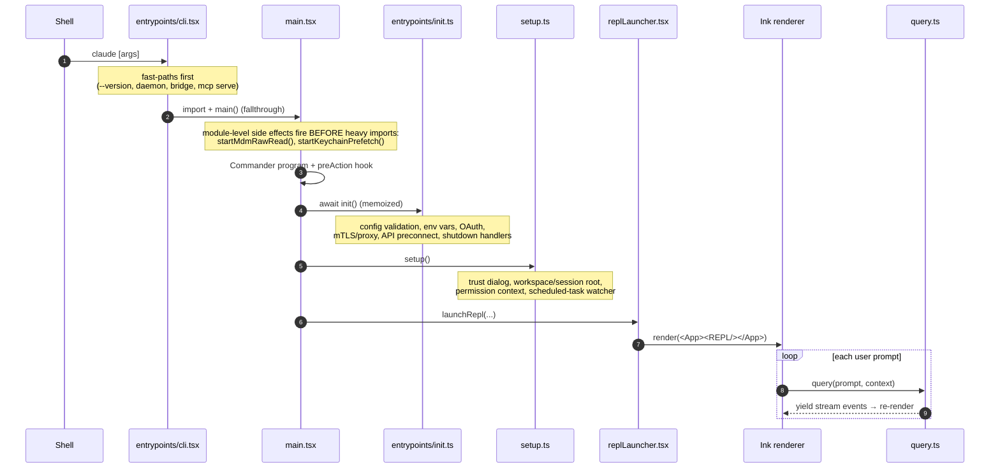
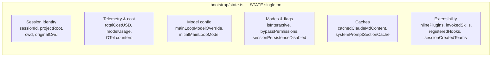

# 01 — Startup & Entrypoints

> From typing `claude` in a shell to a live interactive REPL. Covers the boot sequence,
> the entrypoints, startup performance tricks, CLI flag parsing, and the global state singleton.

← [Index](README.md) · Next → [02 — The Query Loop](02-query-loop.md)

---

## The boot sequence

Roughly: **process entry → fast-path check → full CLI load → `init()` → `setup()` → mount React/Ink → REPL drives `query()` per prompt.** Pre-REPL latency is on the order of a few hundred ms, heavily optimized by the prefetch tricks below.

---

## Entrypoints — what each does and when

| Entrypoint | When it runs | Responsibility |
|---|---|---|
| **`src/entrypoints/cli.tsx`** | Always — the real process entry (`bin: claude`) | Cheap fast-paths *before* loading the world: `--version`, `--dump-system-prompt`, daemon workers, special MCP servers (chrome/computer-use), bridge mode. Falls through to `import('../main.js'); main()`. |
| **`src/main.tsx`** | All interactive/print modes | The orchestrator: builds the Commander.js program, attaches the `preAction` hook, defines the default action handler, and launches the REPL. ~4,700 lines. |
| **`src/entrypoints/init.ts`** | Once per session (memoized), via Commander `preAction` | Config validation, safe env vars, graceful-shutdown handlers, OAuth population, mTLS/proxy/HTTP-agent setup, **API preconnect** (warm TLS), CCR upstream proxy, scratchpad dir. Telemetry init is deferred to *after* the trust dialog. |
| **`src/entrypoints/mcp.ts`** | `claude mcp serve` | Runs Claude Code **as an MCP server** over stdio, exposing its tools to other MCP clients. See [08 — MCP](08-mcp.md). |
| **`src/entrypoints/sdk/`** | Imported by SDK consumers | Pure Zod schemas + TS types for SDK messages (init, control, hooks). No runtime logic — the real SDK execution lives in `server/` and `coordinator/`. |

The fast-path design in `cli.tsx` matters: `claude --version` should load almost nothing, so the heavy module graph (`main.tsx` and everything it pulls in) is only imported on fallthrough.

---

## Startup optimizations (why it feels fast)

The dominant trick is **firing slow side-effects in parallel before the heavy import chain runs**. In `src/main.tsx`, module-level calls kick off:

- **`startMdmRawRead()`** — spawns MDM/policy subprocesses (`plutil` / `reg query`). They complete *during* the ~100ms+ import chain.
- **`startKeychainPrefetch()`** — begins async macOS keychain reads (the biggest single blocker if left synchronous).

Both are **awaited later**, in the Commander `preAction` hook, by which point they've usually finished. Additional overlapping work:

- **API preconnect** (`init.ts`) — opens the TCP+TLS handshake to the Anthropic API in the background so the first model call doesn't pay for it.
- **Commands + agents loading** — file-system walks run in parallel with `setup()`.
- **Remote settings / policy limits** — loaded fire-and-forget; the session proceeds and hot-reloads them when they arrive (fail-open).
- **GrowthBook flags** — read from a disk cache (`getFeatureValue_CACHED_MAY_BE_STALE`) so feature checks never block on the network.

Mental model: *the critical path is "decide what model + mount the UI"; everything slow is shoved off the critical path and joined just-in-time.*

---

## CLI argument parsing

Parsing happens in **two places**:

1. **`cli.tsx` early fast-paths** — a handful of flags handled before Commander even loads.
2. **`main.tsx` Commander program** — the full surface, parsed with `@commander-js/extra-typings`. The default `.action(...)` handler is the main prompt path; subcommands (`mcp`, `plugin`, `auth`, …) route to their own handlers.

Representative flags and their effect:

| Flag | Effect |
|---|---|
| `[prompt]` (positional) | The user's query; in `-p` mode runs headless, else seeds the REPL. |
| `-p, --print` | Headless mode → routes to `src/cli/print.ts` instead of the interactive REPL. |
| `--model <name>` | Override the main-loop model. May trigger a GrowthBook fetch to resolve aliases. |
| `--continue` / `-c` | Resume the previous session transcript instead of starting fresh. |
| `--worktree <dir>` | `chdir` into a git worktree and set the project root. |
| `--agents <json>` | Inject/override agent definitions; merged with on-disk agents. |
| `--mcp-config <file>` | MCP server config (overrides `.mcp.json`). |
| `--settings <file>` | Apply flag-scoped settings (highest precedence source). |
| `--add-dir <dir>` | Add a directory to CLAUDE.md/memory discovery. |
| `--dangerously-skip-permissions` | Bypass permission prompts (see [06 — Permissions](06-permissions.md)). |
| `--bare` | Minimal mode: skip hooks, LSP, plugin sync, auto-memory, keychain. |
| `--output-format text\|json\|stream-json` | (print mode) output shape for SDK consumers. |

How a flag becomes behavior: Commander parses → the action handler reads options → it sets fields in the **global state singleton** (below) and/or the `ToolUseContext` options → those flow into `query()`.

---

## Global state singleton — `src/bootstrap/state.ts`

A single module-level `STATE` object holds everything that must be reachable without prop-drilling: session identity, cost/telemetry counters, model overrides, mode flags, and various caches. It is created once by `getInitialState()` and accessed exclusively through exported getters/setters (direct mutation is discouraged).

Notable contents:

Why a singleton (vs. React state): much of this is read from non-React code (the API client, tools, context builders, the permission engine). The REPL's `AppState` store (see [10 — UI](10-ui-state-rendering.md)) is the *React-reactive* state; `bootstrap/state.ts` is the *process-global* state. They are different and serve different layers — don't confuse them.

Common accessors you'll meet everywhere: `getSessionId()`, `getCwd()` / `setCwdState()`, `getProjectRoot()`, `getTotalCostUSD()`, `getMainLoopModelOverride()`, `getInvokedSkills()`, `isSessionPersistenceDisabled()`.

---

## Where startup hands off to the engine

Once `<App><REPL/></App>` is mounted, the REPL component (`src/screens/REPL.tsx`) owns the prompt loop. On each submission it calls the `query()` async generator (`src/query.ts:219`) and renders the events it yields. That handoff is the boundary between "startup" and "the engine" — continue in [02 — The Query Loop](02-query-loop.md).

---

## Key symbols

| Symbol | File | Role |
|---|---|---|
| `main()` | `entrypoints/cli.tsx` | Process entry; fast-paths then fall through to `main.tsx`. |
| `main()` / `run()` | `main.tsx` | Build Commander program, preAction hook, default action, launch REPL. |
| `init()` | `entrypoints/init.ts` | Memoized config/env/network/OAuth initialization. |
| `setup()` | `setup.ts` | Trust dialog, workspace + session root, permission context. |
| `launchRepl()` | `replLauncher.tsx` | Dynamically import and mount the React/Ink app. |
| `getInitialState()` / `STATE` | `bootstrap/state.ts` | The process-global state singleton + its factory. |
| `startMdmRawRead()` / `startKeychainPrefetch()` | startup utils | Parallel prefetch fired before heavy imports. |
