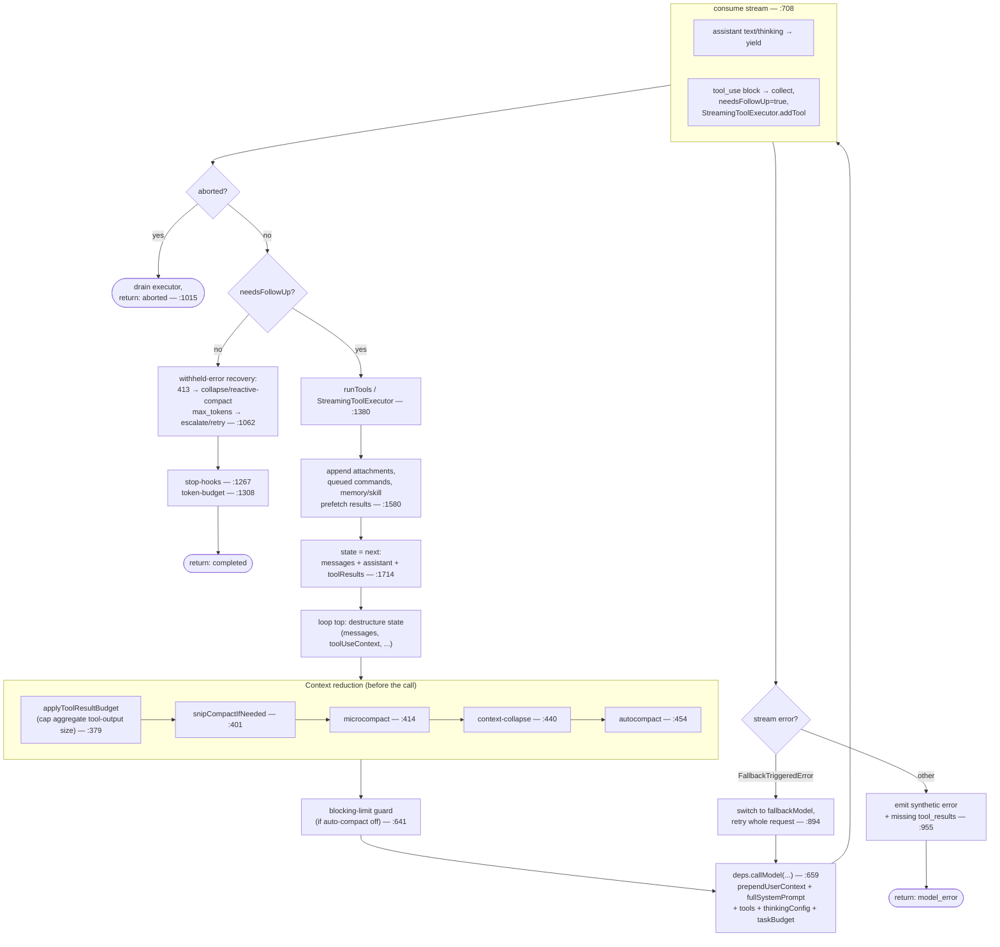
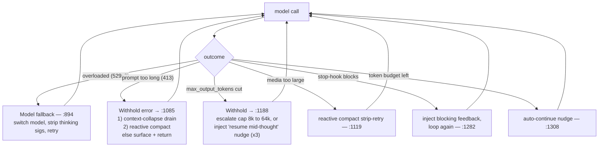

# 02 — The Query Loop (the LLM engine)

> `src/query.ts` is the heart of Claude Code. This is the agentic loop: call the model,
> run the tools it asks for, feed results back, repeat until it stops asking. Everything
> else is machinery around this file.

← [01 — Startup](01-startup.md) · [Index](README.md) · Next → [03 — Context & Prompts](03-context-and-prompts.md)

---

## The shape of it

```ts
// src/query.ts:219
export async function* query(params: QueryParams):
  AsyncGenerator<StreamEvent | RequestStartEvent | Message | TombstoneMessage | ToolUseSummaryMessage, Terminal>
```

`query()` is an **async generator**. It *yields* messages and stream-events as they happen
(so the terminal UI can render live), and it *returns* a `Terminal` value (`{ reason: 'completed' | 'aborted_*' | 'max_turns' | ... }`) only when the turn is truly over.

`query()` (line 219) is a thin wrapper; the real work is in `queryLoop()` (line 241), whose
body is a `while (true)` loop starting at **line 307**. Each pass of that loop is one API
round-trip plus the tool executions it triggers.

State that survives between iterations is held in a single mutable `State` object (`src/query.ts:204`);
each `continue` site rewrites `state = { ... }` rather than mutating nine separate variables.

---

## One iteration, step by step



### 1. Reduce context (lines 365–468)
Before every call, the message array is shrunk to fit the window by a stack of reducers,
run in order: **tool-result budget → snip → microcompact → context-collapse → autocompact**.
Most are feature-gated. Details and rationale in [03 — Context & Prompts](03-context-and-prompts.md).

### 2. Assemble + call the model (lines 659–708)
```ts
for await (const message of deps.callModel({
  messages: prependUserContext(messagesForQuery, userContext), // history + CLAUDE.md/date
  systemPrompt: fullSystemPrompt,                               // prompt + git status
  thinkingConfig, tools, signal,
  options: { model: currentModel, querySource, taskBudget, fallbackModel, ... },
}))
```
`deps.callModel` is `queryModelWithStreaming` (wired in `src/query/deps.ts:36`), which calls
the Anthropic SDK's streaming `messages.create`. The `deps` indirection exists so tests can
inject a fake model without module-level spying (`src/query/deps.ts:21`).

### 3. Consume the stream (lines 708–863)
Each streamed `AssistantMessage` is pushed to `assistantMessages` and `yield`ed to the UI.
Any `tool_use` content block is collected into `toolUseBlocks` and flips `needsFollowUp = true`
(lines 826–835). Crucially, tools begin executing **while the model is still streaming** via the
`StreamingToolExecutor` (line 841) — a read-only tool can finish before the response closes.

### 4. Branch (line 1062)
- **`needsFollowUp === false`** → the model is done talking. Run recovery checks for any
  *withheld* errors, then stop-hooks and the token-budget check, then `return { reason: 'completed' }`.
- **`needsFollowUp === true`** → execute the tools (line 1380), gather `tool_result`s, append
  everything to the next state (line 1714), and loop.

### 5. The agentic append (line 1714)
```ts
const next: State = {
  messages: [...messagesForQuery, ...assistantMessages, ...toolResults],
  ...
}
state = next   // continue the while(true)
```
This single line — "append the assistant turn and its tool results to history, then loop" — **is** the agent.

---

## Streaming tool execution

There are two execution paths, chosen by a feature gate (`config.gates.streamingToolExecution`):

- **`StreamingToolExecutor`** (`src/services/tools/StreamingToolExecutor.ts`) — tools are queued
  as their `tool_use` blocks arrive *during* streaming. Concurrency-safe tools run in parallel;
  a non-concurrency-safe tool gets exclusive access. Results are surfaced in arrival order.
- **`runTools`** (`src/services/tools/toolOrchestration.ts`) — the batch path: partition the
  collected `tool_use` blocks into runs of consecutive concurrency-safe tools, execute, yield
  `{ message, newContext }` updates.

Either way, each tool goes through: **validate input (Zod) → `canUseTool` (permissions) →
PreToolUse hooks → `tool.call()` → serialize result into a `tool_result`**. See
[04 — Tools](04-tools.md) and [06 — Permissions](06-permissions.md).

---

## Recovery paths (why the loop is 1,700 lines, not 100)

The happy path is short. Most of `query.ts` is *not losing the turn* when the API misbehaves.
Each of these `continue`s the loop with adjusted state instead of throwing:



| Mechanism | Trigger | What it does | Line |
|---|---|---|---|
| **Model fallback** | 3 consecutive `529` (overloaded) + `fallbackModel` set | Switch model mid-turn, strip model-bound thinking signatures, retry the request | 894 |
| **413 recovery** | Prompt-too-long error (withheld from UI) | Try context-collapse drain, then reactive compact, then surface | 1085 |
| **max_output_tokens recovery** | Response was cut off | Escalate the output cap once (8k→64k), else inject a "resume mid-thought" meta-message and re-run, up to 3× | 1188 |
| **Media recovery** | Image/PDF too large | Reactive compact strips media and retries | 1119 |
| **Stop-hook blocking** | A stop-hook returns a blocking error | Append the feedback and loop again (so "keep going until X" hooks work) | 1282 |
| **Token-budget continuation** | User gave a large output budget (`+500k`-style) and it's not exhausted | Append a nudge and continue automatically | 1308 |

A recurring subtlety: recoverable errors (413, max_output_tokens, media) are **withheld** from
the yielded stream (lines 799–822) so SDK consumers that terminate on any `error` field don't
kill the session while recovery is still running. They're only surfaced if recovery is exhausted.

---

## `QueryEngine.ts` vs `query.ts`

Don't be misled by the README: `src/QueryEngine.ts` (~1,300 lines) is a **higher-level,
SDK-facing wrapper** — it sets up `QueryParams`, threads SDK message types, manages usage
accumulation, and ultimately drives `query()`. The actual agentic loop is `query.ts`. When you
want to understand "how the model is called," read `query.ts`.

---

## maxTurns, abort, and subagents

- **`maxTurns`** — optional cap; when exceeded, a `max_turns_reached` attachment is emitted and
  the loop returns `{ reason: 'max_turns' }` (lines 1705, 1508).
- **Abort** — `toolUseContext.abortController.signal` (Ctrl+C). On abort mid-stream or mid-tool,
  the loop drains the `StreamingToolExecutor` to synthesize `tool_result`s for in-flight tools
  (so no `tool_use` is left without a matching result), then returns an `aborted_*` reason.
- **Subagents** — when `query()` runs for a sub-agent, `toolUseContext.agentId` is set and
  `queryTracking.depth` increments. Many behaviors (tool-use summaries, task summaries, main-thread
  queue draining) are gated on `!agentId`. See [09 — Agents](09-agents-coordinator-tasks.md).

---

## Key symbols

| Symbol | File:line | Role |
|---|---|---|
| `query()` | `query.ts:219` | Public async generator; wraps `queryLoop`, fires command-lifecycle completion. |
| `queryLoop()` | `query.ts:241` | The `while(true)` agentic loop. |
| `QueryParams` | `query.ts:181` | Inputs: messages, systemPrompt, userContext, systemContext, canUseTool, toolUseContext, fallbackModel, querySource, taskBudget, deps. |
| `State` | `query.ts:204` | Mutable cross-iteration state. |
| `deps.callModel` | `query/deps.ts:36` | `= queryModelWithStreaming`; the seam for the actual API call. |
| `runTools` / `StreamingToolExecutor` | `services/tools/` | The two tool-execution paths. |
| `handleStopHooks` | `query/stopHooks.ts` | Stop-hook evaluation at turn end. |
| `checkTokenBudget` | `query/tokenBudget.ts` | The `+500k` auto-continue decision. |
