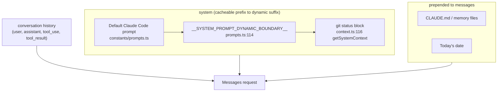
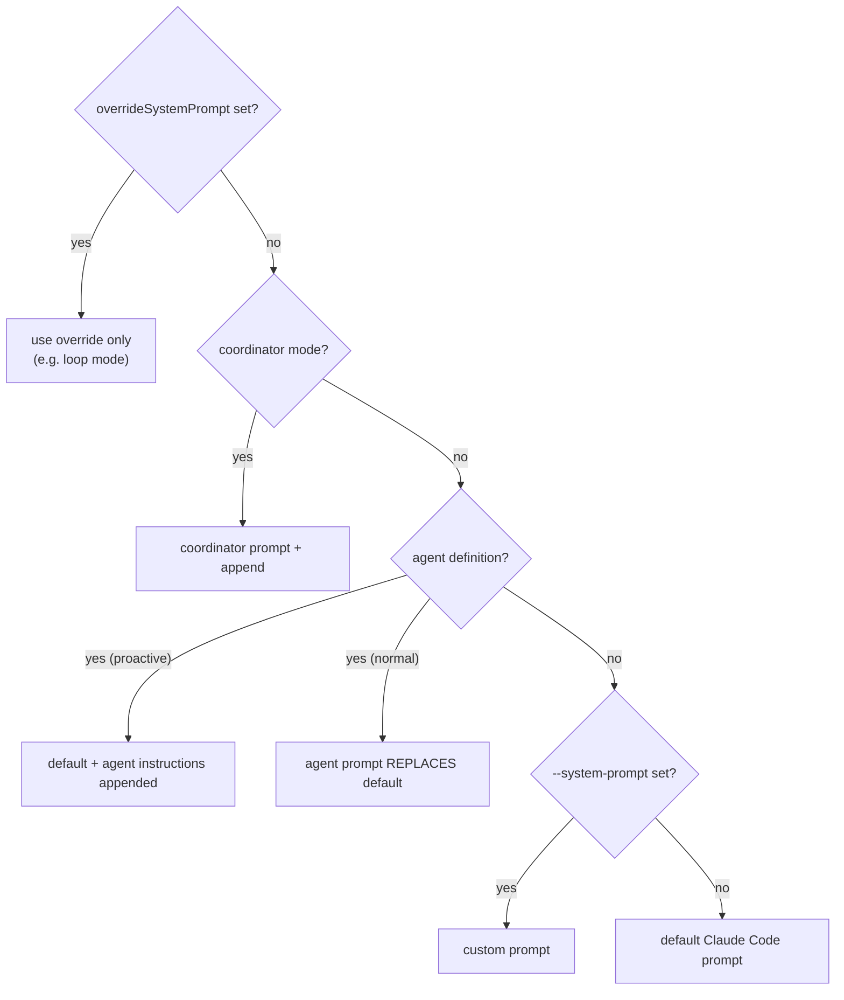

# 03 — Context & Prompts

> How the request to the model is composed: the system prompt, the per-conversation context,
> prompt caching, and the five-layer compaction stack that delivers "unlimited context."

← [02 — The Query Loop](02-query-loop.md) · [Index](README.md) · Next → [04 — Tools](04-tools.md)

---

## The three text inputs to every request

| Input | Built by | Contents |
|---|---|---|
| **System prompt** | `buildEffectiveSystemPrompt` (`utils/systemPrompt.ts:41`) | The default prompt, or an agent/coordinator/custom prompt, plus any `--append-system-prompt`. |
| **System context** | `getSystemContext` (`context.ts:116`) | Git status: branch, default branch, `git status --short`, last 5 commits, git user. Appended *to the system prompt* at `query.ts:449`. |
| **User context** | `getUserContext` (`context.ts:155`) | `CLAUDE.md` + nested memory files, and today's date. *Prepended to the messages* at `query.ts:660`. |

Both `getSystemContext` and `getUserContext` are **memoized for the conversation** — git status and CLAUDE.md are read once and cached, not re-shelled every turn.

---

## The default system prompt

The text that defines Claude Code's behavior lives in `src/constants/prompts.ts`. It is
assembled from sections (each a small function returning a string), composed via
`systemPromptSection` / `resolveSystemPromptSections`. Notable sections:

- **Intro** (`getSimpleIntroSection`, ~:175) — "You are an interactive agent that helps users with software engineering tasks…", plus the cyber-risk instruction and the "never guess URLs" rule.
- **`# System`** (`getSimpleSystemSection`, ~:186) — the rules about permission modes, `<system-reminder>` tags, prompt-injection flagging, hooks, and automatic context compression.
- **Hooks** (`getHooksSection`, :127), **system reminders** (:131), **language** (:142), **output style** (:151), **MCP instructions** (:160).
- **Model identity** — `FRONTIER_MODEL_NAME = 'Claude Opus 4.6'` (:118) and the model-ID table (:121).

### Prompt priority (which prompt wins)
`buildEffectiveSystemPrompt` (`utils/systemPrompt.ts:41`) resolves in this order:

`--append-system-prompt` is always tacked on at the end (except when an override is set).

---

## Prompt caching — the constraint that shapes everything

Anthropic's prompt cache rewards byte-identical request prefixes. Claude Code is engineered
around this. The marker `SYSTEM_PROMPT_DYNAMIC_BOUNDARY` (`constants/prompts.ts:114`) splits
the system prompt into:

- **Static prefix** (before the marker) — cross-session/org cacheable; can use `scope: 'global'`.
- **Dynamic suffix** (after the marker) — session/user-specific (git status, injected memory).

`getCacheControl()` (`services/api/claude.ts:358`) decides where `cache_control: { type: 'ephemeral', ttl?, scope? }` breakpoints go. Consequences seen throughout the code:

- **Tools are sorted deterministically** within partitions (built-in, then MCP) so adding/removing an MCP tool mid-session doesn't bust the cache (see [04 — Tools](04-tools.md)).
- **Zod schemas are referentially stable** per session (`lazySchema`) so the serialized tool block doesn't change byte-for-byte.
- **Fork sub-agents reuse the parent's *rendered* system prompt bytes** (`Tool.ts:299` `renderedSystemPrompt`) instead of recomputing it — recomputation could diverge if a GrowthBook flag flipped cold→warm. See [09 — Agents](09-agents-coordinator-tasks.md).
- **Global cache scope** requires first-party API and *no* MCP tools (per-user dynamic tools can't be shared across users).

If you change anything in the static prefix, you pay full input-token price on the next call. That's why so much code goes out of its way to keep the prefix stable.

---

## The five-layer compaction stack

The system prompt promises "unlimited context through automatic summarization." That promise
is kept by five reducers run before each model call (in `query.ts`, in this order):

| # | Strategy | Trigger | What it does | Feature gate |
|---|---|---|---|---|
| 1 | **Tool-result budget** (`applyToolResultBudget`, `utils/toolResultStorage.ts`) | Aggregate tool output exceeds a per-message budget | Replaces oversized old tool outputs with pointers; persists the replacement records for resume | always (no-op if state unset) |
| 2 | **Snip** (`services/compact/snipCompact.ts`) | History has low-value spans | Drops them; reports `tokensFreed` so autocompact's threshold accounts for it | `HISTORY_SNIP` |
| 3 | **Microcompact** (`services/compact/microCompact.ts`) | Old, compactable tool calls present | Surgically clears old tool *result content* (FileRead, Bash, Grep, Glob, WebFetch/Search, Edit, Write) by `tool_use_id`; cache-aware variant stores deletions as cache-edits | always / `CACHED_MICROCOMPACT` |
| 4 | **Context-collapse** (`services/contextCollapse/`) | Near the limit | Projects a "collapsed view" by summarizing spans, keeping a replayable commit log so collapses persist across turns | `CONTEXT_COLLAPSE` |
| 5 | **Autocompact** (`services/compact/autoCompact.ts` → `compact.ts`) | Token count crosses the threshold (with a buffer below the hard window) | The big one: spawns a **forked summarization query** that reads the whole conversation and writes a structured summary; the turn continues from that summary | always (unless disabled) |

### How autocompact's "summary sub-query" works
`compactConversation()` (`services/compact/compact.ts`) calls `queryModelWithStreaming()` — the
*same* API path as a normal turn — with the conversation plus a "summarize this" prompt and no
tools. The model writes a structured summary (Primary request & intent, key technical concepts,
files & code touched, errors & fixes, pending tasks, current work verbatim, optional next step).
That summary becomes a compact-boundary message; subsequent turns read history *after* the
boundary (`getMessagesAfterCompactBoundary`). This is literally Claude summarizing its own
conversation so the loop can keep going past the context window.

### Reactive vs. proactive
Layers 1–5 run *proactively* (before the call). If a call still returns **413 prompt-too-long**,
the loop falls into *reactive* recovery (`query.ts:1085`): drain staged collapses, then
`reactiveCompact.tryReactiveCompact()`, then surface the error if nothing worked. See
[02 — The Query Loop](02-query-loop.md#recovery-paths-why-the-loop-is-1700-lines-not-100).

---

## Attachments & prefetch (extra context injected mid-turn)

After tools run, `getAttachmentMessages` (`utils/attachments.ts`) injects additional context as
`attachment` messages before the next iteration: edited-file diffs, queued user/command messages,
and the results of two background prefetches kicked off earlier in the turn:

- **Memory prefetch** (`startRelevantMemoryPrefetch`) — relevant memory files surfaced while the model streams.
- **Skill-discovery prefetch** (`services/skillSearch/prefetch.ts`, `EXPERIMENTAL_SKILL_SEARCH`) — candidate skills discovered in the background.

Both are awaited *non-blocking* (polled for `settledAt`) so they hide under the model's streaming latency instead of adding to it.

---

## Key symbols

| Symbol | File:line | Role |
|---|---|---|
| `buildEffectiveSystemPrompt` | `utils/systemPrompt.ts:41` | Resolve which system prompt to use (override/coordinator/agent/custom/default). |
| `getSystemContext` | `context.ts:116` | Memoized git-status block appended to the system prompt. |
| `getUserContext` | `context.ts:155` | Memoized CLAUDE.md + date prepended to messages. |
| `SYSTEM_PROMPT_DYNAMIC_BOUNDARY` | `constants/prompts.ts:114` | Static/dynamic cache split marker. |
| `getCacheControl` | `services/api/claude.ts:358` | Places `cache_control` breakpoints. |
| `compactConversation` | `services/compact/compact.ts` | The forked summarization query (autocompact/reactive). |
| `getMessagesAfterCompactBoundary` | `utils/messages.ts` | Reads history after the latest compact boundary. |
