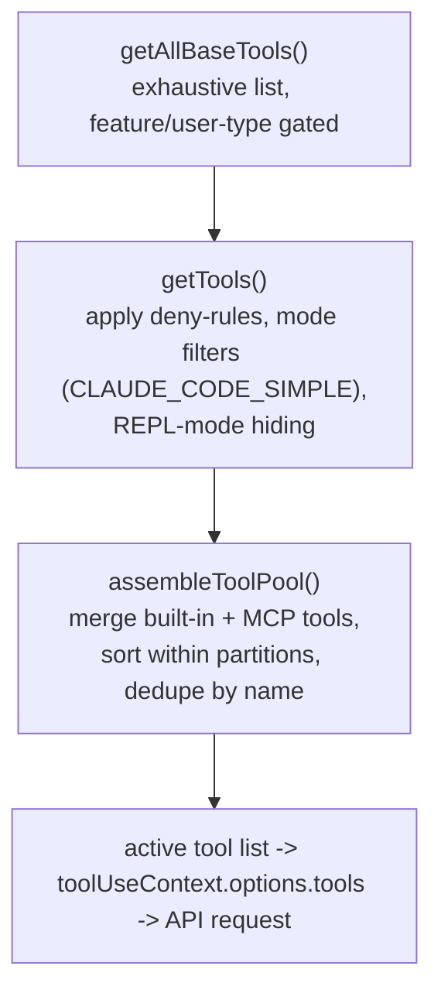
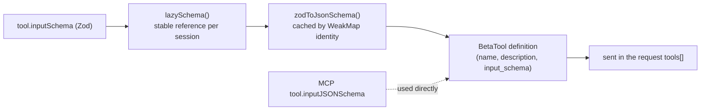

# 04 — Tool System

> Every capability the model can invoke is a "tool." This doc covers the `Tool` contract,
> how the active catalog is built, how a Zod schema becomes what the model sees, how tools
> execute (and run in parallel), and deferred/searchable tools.

← [03 — Context & Prompts](03-context-and-prompts.md) · [Index](README.md) · Next → [05 — Commands](05-commands.md)

---

## The `Tool` contract

A tool is an object implementing the `Tool<Input, Output>` type (`src/Tool.ts:362`). The model
only ever sees its name, description, and input schema; everything else is local machinery.

```ts
type Tool<Input, Output> = {
  call(args, context, canUseTool, parentMessage, onProgress): Promise<ToolResult<Output>> // :379
  description(input, options): Promise<string>                                            // :386
  readonly inputSchema: Input            // Zod schema -> JSON Schema for the model          // :394
  readonly inputJSONSchema?: ...         // MCP tools provide JSON Schema directly           // :397
  isConcurrencySafe(input): boolean      // can run in parallel with other tools             // :402
  isEnabled(): boolean                   // gate on/off (feature flags, env, user type)       // :403
  isReadOnly(input): boolean             // read vs. mutate                                   // :404
  isDestructive?(input): boolean         // irreversible (delete/overwrite/send)              // :405
  interruptBehavior?(): 'cancel'|'block' // what a new user message does mid-run              // :416
  searchHint?: string                    // keyword hint for ToolSearch (deferred tools)      // :378
  aliases?: string[]                     // backwards-compatible renames                      // :371
  // ...isSearchOrReadCommand, inputsEquivalent, outputSchema, backfillObservableInput, etc.
}
```

`ToolResult<T>` (`Tool.ts:321`) carries `{ data, newMessages?, contextModifier?, mcpMeta? }` — a
tool can emit extra messages and (if not concurrency-safe) mutate the `ToolUseContext` for
subsequent tools. Tools are built via a `buildTool()` helper that spreads sensible defaults over
a partial definition, so most tools only specify what differs.

### `ToolUseContext` — the runtime backpack
`ToolUseContext` (`Tool.ts:158`) is the big object threaded through the whole loop and passed into
every `call()`. It carries the active `options.tools`, the app-state accessor (`getAppState`),
the abort controller, the message history, permission context, agent identity (`agentId`),
file-read state, query tracking, and dozens of UI/callback hooks. It's how a tool reaches the
rest of the system without imports.

---

## Building the active catalog



- **`getAllBaseTools()`** (`tools.ts:193`) — the full built-in list, respecting feature flags and
  ant-only gates, and conditionals (e.g. `GlobTool` omitted when native ripgrep search is available,
  `ToolSearchTool` only when deferred loading is on).
- **`getTools()`** (`tools.ts:271`) — applies permission deny-rules and mode filters.
- **`assembleToolPool()`** (`tools.ts:345`) — merges built-in + MCP tools, **sorts alphabetically
  within each partition**, and dedupes by name (built-ins win). The deterministic order is a
  prompt-cache stability requirement (see [03 — Prompt caching](03-context-and-prompts.md#prompt-caching--the-constraint-that-shapes-everything)).

The catalog can change between turns; `query.ts` calls `options.refreshTools()` so newly-connected
MCP servers' tools appear mid-conversation (`query.ts:1660`).

---

## Schema → what the model sees



`toolToAPISchema()` (`utils/api.ts`) serializes each tool; `zodToJsonSchema()` converts the Zod
schema to JSON Schema and caches by identity (so it isn't recomputed every turn, and so the bytes
stay stable for caching). MCP tools skip Zod and provide `inputJSONSchema` directly.

---

## Execution & concurrency

```mermaid
sequenceDiagram
    autonumber
    participant Loop as query.ts
    participant Exec as runTools / StreamingToolExecutor
    participant Perm as canUseTool
    participant Hook as PreToolUse hooks
    participant Tool as tool.call()

    Loop->>Exec: tool_use blocks
    Note over Exec: partition by isConcurrencySafe(input)<br/>safe -> parallel batch; unsafe -> exclusive
    loop per tool
        Exec->>Exec: validate input (Zod inputSchema)
        Exec->>Perm: can this run? (mode + rules + classifier)
        Perm-->>Exec: allow / deny / ask
        Exec->>Hook: PreToolUse (may allow/deny/modify input)
        Hook-->>Exec: decision
        Exec->>Tool: call(args, context, ...)
        Tool-->>Exec: ToolResult { data, newMessages?, contextModifier? }
        Exec-->>Loop: tool_result message (+ newContext)
    end
```

- **Concurrency** is driven by `isConcurrencySafe(input)` (default `false`, conservative). The
  executor groups consecutive safe tools to run in parallel; an unsafe tool gets exclusive access
  and may return a `contextModifier` that mutates `ToolUseContext` for following tools.
- **`isReadOnly` / `isDestructive`** feed both scheduling and permissions. For example `BashTool`
  sets `isConcurrencySafe === isReadOnly`, and `isReadOnly` only returns true for pure-read commands
  (no `cd`, no mutations) — so two `grep`s parallelize but `rm` does not.
- See [02 — Streaming tool execution](02-query-loop.md#streaming-tool-execution) for the two
  execution paths and [06 — Permissions](06-permissions.md) for the `canUseTool` pipeline.

---

## Deferred tools & ToolSearch

When the tool catalog is large (many MCP tools), sending every schema up front wastes context.
Tools can set `shouldDefer: true` and are advertised with `defer_loading: true`. The
**`ToolSearchTool`** (`tools/ToolSearchTool/`) lets the model find a deferred tool by keyword
(`searchHint` matching) or by exact name (`select:ToolName`) — its schema is then loaded on
demand. Enabled via `ENABLE_TOOL_SEARCH` (e.g. `auto`, `auto:N%`), typically when MCP tool
descriptions would exceed ~10% of the context window. (You can see this in the live tool list as
deferred tools that must be fetched before use.)

---

## The tool inventory (~39)

| Category | Tools |
|---|---|
| **File I/O** | `FileReadTool`, `FileWriteTool`, `FileEditTool`, `NotebookEditTool` |
| **Search** | `GlobTool`, `GrepTool`, `WebSearchTool`, `WebFetchTool` |
| **Execution** | `BashTool`, `PowerShellTool`, `REPLTool`, `SkillTool` |
| **Agents & teams** | `AgentTool`, `SendMessageTool`, `TeamCreateTool`, `TeamDeleteTool` |
| **Tasks (v2)** | `TaskCreateTool`, `TaskGetTool`, `TaskUpdateTool`, `TaskListTool`, `TaskStopTool`, `TaskOutputTool` |
| **Mode & state** | `EnterPlanModeTool`, `ExitPlanModeTool`, `EnterWorktreeTool`, `ExitWorktreeTool`, `TodoWriteTool` |
| **MCP** | `MCPTool`, `McpAuthTool`, `ListMcpResourcesTool`, `ReadMcpResourceTool` |
| **Discovery / meta** | `ToolSearchTool`, `AskUserQuestionTool`, `ConfigTool`, `LSPTool` |
| **Scheduling / async** | `ScheduleCronTool` (`CronCreate`), `RemoteTriggerTool`, `SleepTool`, `SyntheticOutputTool` |
| **Proactive / ant-only** | `BriefTool`, `MonitorTool`, `TungstenTool`, plus testing tools under `tools/testing/` |

(Exact set is feature-flag- and user-type-dependent; this is the on-disk catalog.)

---

## Anatomy of a tool directory

Tools live in `src/tools/<Name>/`. Typical files:

| File | Purpose |
|---|---|
| `<Name>.ts` / `<Name>.tsx` | The tool definition (`buildTool({ call, isReadOnly, ... })`). |
| `prompt.ts` | The tool's description text sent to the model. |
| `constants.ts` | Tool name + constants. |
| `types.ts` | Zod input schema + types. |
| `UI.tsx` | How the tool's invocation/result renders in the terminal. |
| (extras) | e.g. `BashTool/` has `bashPermissions.ts`, `readOnlyValidation.ts`, `commandSemantics.ts`. |

`AgentTool/` is the heaviest (it spawns nested `query()` loops — see [09 — Agents](09-agents-coordinator-tasks.md)).

---

## Key symbols

| Symbol | File:line | Role |
|---|---|---|
| `Tool<Input,Output>` | `Tool.ts:362` | The tool contract. |
| `ToolUseContext` | `Tool.ts:158` | Runtime context threaded into every tool. |
| `getAllBaseTools` / `getTools` / `assembleToolPool` | `tools.ts:193/271/345` | Build the active catalog. |
| `findToolByName` / `toolMatchesName` | `Tool.ts:358/348` | Look up a tool by name or alias. |
| `runTools` | `services/tools/toolOrchestration.ts` | Batch execution path. |
| `StreamingToolExecutor` | `services/tools/StreamingToolExecutor.ts` | Stream-as-you-go execution path. |
| `zodToJsonSchema` / `toolToAPISchema` | `utils/zodToJsonSchema.ts`, `utils/api.ts` | Schema → API serialization (cached). |
