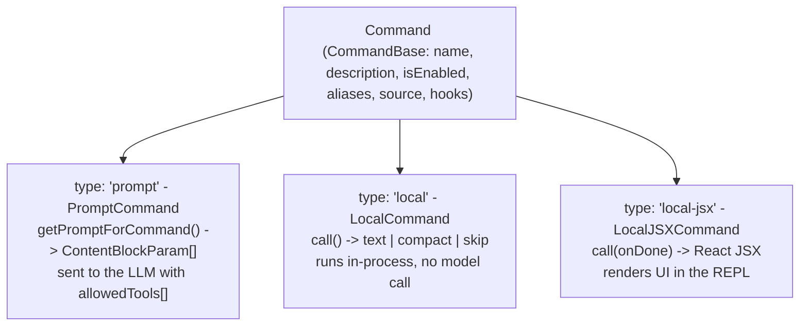
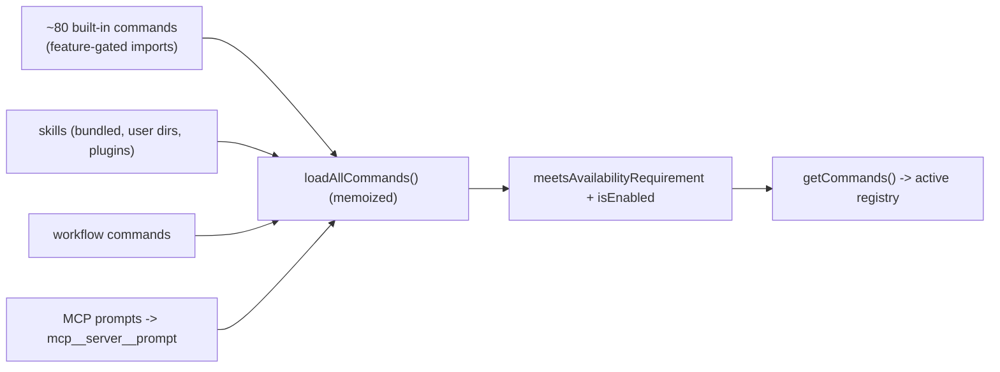
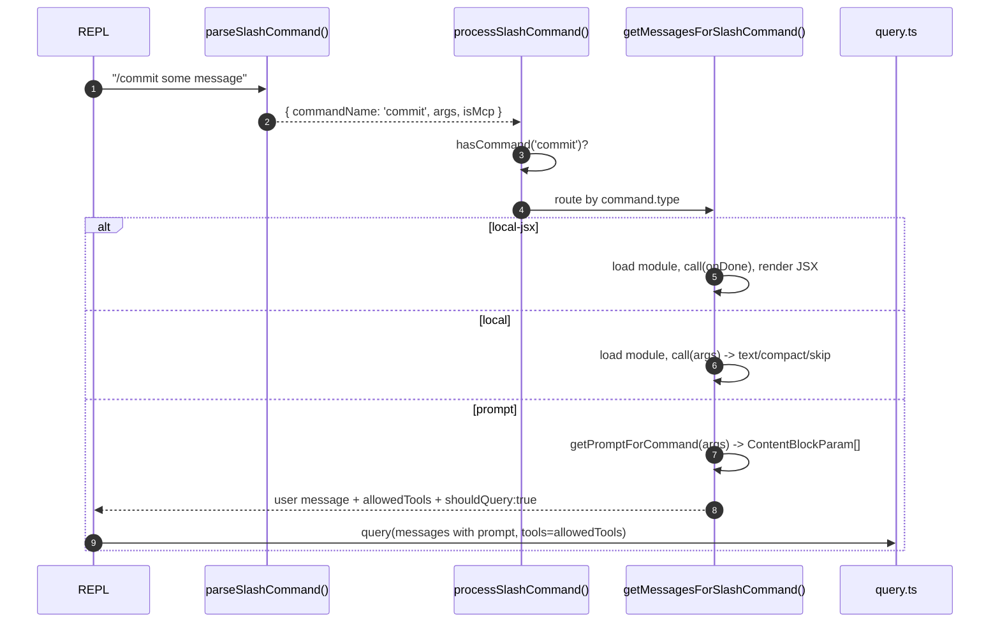

# 05 — Command System

> Slash commands (`/commit`, `/review`, `/cost`, `/doctor`, …): the three command types,
> how a typed `/foo` is parsed and dispatched, and how prompt-commands feed the query loop.

← [04 — Tools](04-tools.md) · [Index](README.md) · Next → [06 — Permissions](06-permissions.md)

---

## Three kinds of command

`Command` (`src/types/command.ts:205`) is a discriminated union over `type`:

| Type | Returns | Touches the model? | Examples |
|---|---|---|---|
| **PromptCommand** | `ContentBlockParam[]` from `getPromptForCommand(args, ctx)` | **Yes** — its output becomes a user message + `allowedTools` and triggers a query | `/commit`, `/review` |
| **LocalCommand** | `LocalCommandResult` (`text` \| `compact` \| `skip`) | No — pure in-process | `/cost`, `/version` |
| **LocalJSXCommand** | React JSX + an `onDone()` callback | No (renders UI; `onDone` may then trigger a query) | `/doctor`, `/install` |

All three extend `CommandBase` (name, description, `isEnabled`, aliases, `source`, optional hooks).

---

## Registry & registration

`src/commands.ts` assembles the command list:

- **Built-ins** — ~80 statically imported commands, with feature-gated imports for conditional
  ones (`PROACTIVE`, `KAIROS`, `BRIDGE_MODE`, `WORKFLOW_SCRIPTS`, …). Internal-only commands are
  filtered from external builds.
- **Dynamic sources** — `loadAllCommands()` merges in: bundled skills, built-in plugin skills,
  user skill directories (`.claude/skills/`), workflow commands, plugin commands, plugin skills,
  and MCP prompts.
- **Availability gating** — `meetsAvailabilityRequirement()` filters by surface
  (`claude-ai` / `console`) before `isEnabled()` runs. `getCommands()` is the memoized entry point.

---

## Dispatch flow

1. **`parseSlashCommand()`** (`slashCommandParsing.ts`) — regex-splits `/<name> <args>` and flags MCP commands.
2. **`processSlashCommand()`** (`processSlashCommand.tsx`) — validates the command exists and routes by type.
3. **`getMessagesForSlashCommand()`** — type switch:
   - **local-jsx**: lazy-load, `call(onDone, ctx, args)`, render JSX, await `onDone`.
   - **local**: lazy-load, `call(args, ctx)`, handle the result union.
   - **prompt**: `getPromptForCommand()` → wrap as a user message + inject `allowedTools` + set `shouldQuery: true`.

Slash commands are processed **after** the turn (not sent as raw text mid-turn) — the query loop
explicitly excludes them from its mid-turn queue drain (`query.ts:1573`).

### PromptCommand → LLM
For `/commit`, `getPromptForCommand()` returns markdown instructions, often with embedded shell
output (e.g. `git status`/`git diff` captured at expansion time), and sets a restricted tool
allow-list like `['Bash(git add:*)', 'Bash(git commit:*)']`. That becomes a user message, the
allowed tools enter the `ToolUseContext`, and `query()` runs as normal — the model sees the
instructions, calls the permitted git tools, and reports back.

### Forked commands
A PromptCommand with `context: 'fork'` runs in an **isolated sub-agent** with its own token budget
(`executeForkedSlashCommand` → `runAgent`). In assistant/proactive mode this can be fire-and-forget,
with the result re-enqueued as a meta prompt. See [09 — Agents](09-agents-coordinator-tasks.md).

---

## Skill-backed commands

Skills (markdown files with frontmatter) become commands too:

- **`getSkillToolCommands()`** (`commands.ts`) — all prompt-commands the *model* may invoke via
  the `SkillTool` (everything not `disableModelInvocation`).
- **`getSlashCommandToolSkills()`** (used in `query.ts:22`) — the subset surfaced in `/skills`.
- User skills load from `.claude/skills/`, `~/.claude/skills/`, and policy dirs; conditional skills
  can activate when certain file paths are touched. See [12 — Skills](12-plugins-skills-memory.md).

---

## Command inventory (built-ins, by theme)

| Theme | Commands |
|---|---|
| Session | `/resume`, `/rewind`, `/clear`, `/exit`, `/help`, `/status`, `/share` |
| Code | `/commit`, `/review`, `/diff`, `/branch`, `/security-review`, `/pr_comments` |
| Analysis | `/cost`, `/usage`, `/context`, `/doctor`, `/insights` |
| Config | `/config`, `/model`, `/theme`, `/vim`, `/keybindings`, `/permissions`, `/hooks`, `/plugin`, `/mcp` |
| AI features | `/plan`, `/effort`, `/compact`, `/memory`, `/fast`, `/skills`, `/tasks`, `/agents` |
| Integrations | `/ide`, `/mobile`, `/desktop`, `/chrome` |
| Feature-gated / ant | `/proactive`, `/brief`, `/assistant`, `/bridge`, `/workflows`, `/buddy`, `/fork`, `/ultraplan`, … |

(~100 entries under `src/commands/`; availability varies by build and surface.)

---

## Key symbols

| Symbol | File:line | Role |
|---|---|---|
| `Command` | `types/command.ts:205` | The 3-way union + base. |
| `getCommands()` | `commands.ts` | Memoized active registry. |
| `loadAllCommands()` | `commands.ts` | Merge all command sources. |
| `parseSlashCommand()` | `slashCommandParsing.ts` | Parse `/<name> <args>`. |
| `processSlashCommand()` | `processSlashCommand.tsx` | Dispatch entry from the REPL. |
| `getMessagesForSlashCommand()` | `processSlashCommand.tsx` | Route by command type. |
| `getSkillToolCommands()` / `getSlashCommandToolSkills()` | `commands.ts` | Model-invocable + listed skills. |
