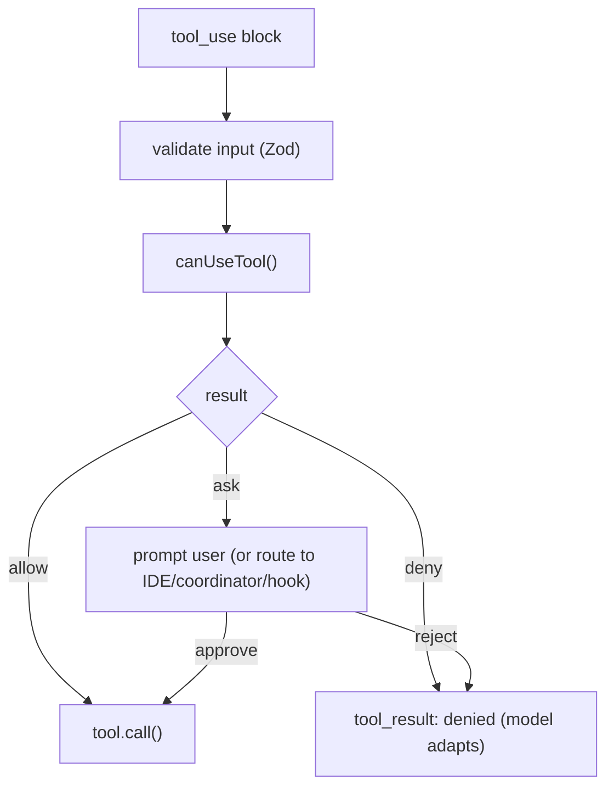
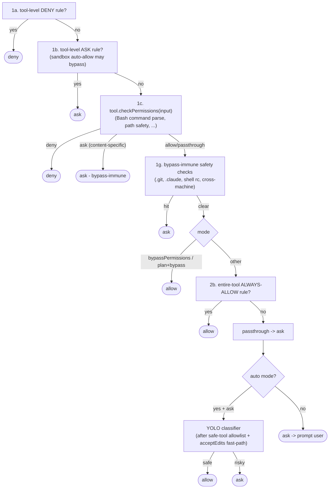
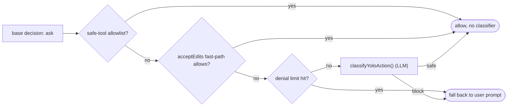

# 06 — Permission System

> Before any tool runs, `canUseTool` decides allow / deny / ask. This doc covers the permission
> modes, the ordered decision pipeline, the rule model, the auto classifier, and hook integration.

← [05 — Commands](05-commands.md) · [Index](README.md) · Next → [07 — Services](07-services-api-auth.md)

---

## Where it sits

Every tool execution in [02 — The Query Loop](02-query-loop.md) passes through a `CanUseToolFn`
(`src/hooks/useCanUseTool.tsx`). The decision engine is `hasPermissionsToUseTool` →
`hasPermissionsToUseToolInner` in `src/utils/permissions/permissions.ts`.

---

## Permission modes

`PermissionMode` (`src/types/permissions.ts`) — the user-facing modes plus internal ones:

| Mode | Behavior |
|---|---|
| **`default`** | Prompt before anything not explicitly allowed. The baseline. |
| **`acceptEdits`** | Auto-allow edit/write tools inside the working directory; still classify/ask outside it. |
| **`plan`** | Plan mode — behaves like `default` unless the user *had* `bypassPermissions` available; read-heavy, no writes expected. |
| **`bypassPermissions`** | Auto-allow everything **except** bypass-immune safety checks (e.g. `.git/`, `.claude/`, shell rc files, cross-machine paths) and explicit ask-rules. Set by `--dangerously-skip-permissions`. |
| **`dontAsk`** | Convert every `ask` into a hard `deny` (no prompts at all). |
| **`auto`** *(ant-only, gated)* | A transcript classifier auto-approves safe actions and prompts on uncertain/risky ones. |
| **`bubble`** *(internal)* | Used internally; not user-addressable. |

---

## The decision pipeline

`hasPermissionsToUseToolInner` evaluates in order; **first match wins**:

Two things are **bypass-immune** — they prompt even under `bypassPermissions`/`acceptEdits`:
content-specific ask-rules returned by a tool's `checkPermissions`, and the hard safety checks for
sensitive paths. That's a deliberate guardrail: "skip permissions" never means "let me overwrite `.git`."

---

## The rule model

Rules come from multiple **sources**, evaluated with precedence (highest first):

| Source | Where |
|---|---|
| `policySettings` | Enterprise/managed settings (read-only, can't be deleted) |
| `flagSettings` | CLI flags (`--allow`, `--deny`, `--settings`) |
| `localSettings` | `.claude/settings.local.json` (per-session, gitignored) |
| `projectSettings` | `.claude/settings.json` (committed) |
| `userSettings` | `~/.claude/settings.json` |
| `command` / `session` / `cliArg` | Runtime (`/permissions add …`, ad-hoc, session-scoped) |

Each rule is `{ source, ruleBehavior: 'allow'|'deny'|'ask', ruleValue: { toolName, ruleContent? } }`.
`ruleContent` lets a rule scope to specific inputs, e.g. `Bash(git commit:*)` matches only git-commit
bash invocations. Tools implement their own matchers in `checkPermissions` (Bash parses the command
line; file tools run path-safety checks).

---

## The auto classifier (ant-only)

When `mode === 'auto'` and the base decision is `ask`, instead of prompting, an LLM classifier
(`classifyYoloAction`, `src/utils/permissions/yoloClassifier.ts`) judges whether the action is safe.
Guards around it:

- **Safe-tool allowlist** — read-only tools (FileRead, Grep, Glob, LSP, ListMcpResources), task-metadata tools (TodoWrite, Task*), and UI-safe tools (AskUserQuestion, EnterPlanMode, SendMessage) skip the classifier entirely.
- **acceptEdits fast-path** — if simulating `acceptEdits` would allow it, skip the classifier.
- **Denial tracking** (`denialTracking.ts`) — after a few consecutive denials (or a session total), fall back to normal prompting to break classifier→deny loops. A successful tool use resets the consecutive counter.
- **Fail-closed** — if the classifier can't reach the API (non-interactive, overload), it falls back to prompting with a grace period.

---

## Hook integration

`PermissionRequest` / `PreToolUse` hooks run **after** the mode/rule checks but **before** the user
prompt. A hook can return `{ behavior: 'allow' | 'deny', updatedInput?, updatedPermissions? }` — so a
hook can approve, reject, or *rewrite the tool input* before execution. There are several handler
contexts: interactive (main thread, hooks race the user prompt), coordinator worker, and headless
agent (hooks resolved synchronously). If no hook decides, the flow proceeds to the UI prompt.

This is how the system-prompt line "treat feedback from hooks as coming from the user" is enforced
in practice.

---

## Key symbols

| Symbol | File | Role |
|---|---|---|
| `CanUseToolFn` | `hooks/useCanUseTool.tsx` | The permission function signature passed into `query()` and tools. |
| `hasPermissionsToUseTool` / `…Inner` | `utils/permissions/permissions.ts` | The decision engine (outer wrapper + ordered pipeline). |
| `PermissionMode` | `types/permissions.ts` | The mode enum. |
| `PermissionResult` / `PermissionDecision` | `types/permissions.ts` | `checkPermissions` output (with passthrough) vs. final allow/deny/ask. |
| `ToolPermissionContext` | `Tool.ts:123` | Immutable mode + rule sets + working dirs, lives on `AppState`. |
| `classifyYoloAction` | `utils/permissions/yoloClassifier.ts` | The auto-mode LLM classifier. |
| `DenialTrackingState` | `utils/permissions/denialTracking.ts` | Consecutive/total denial counters + fallback threshold. |
