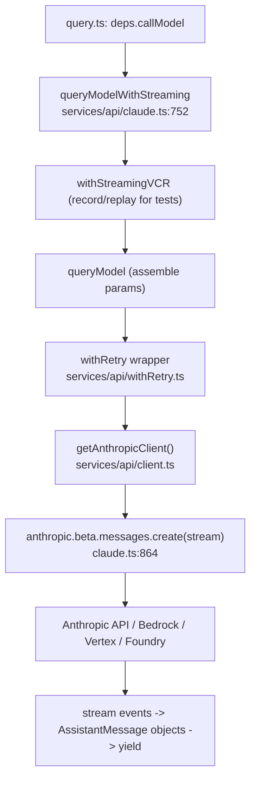
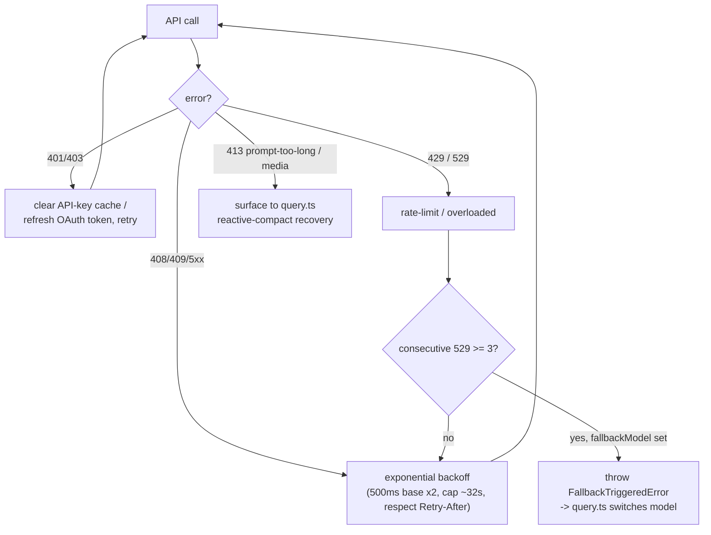
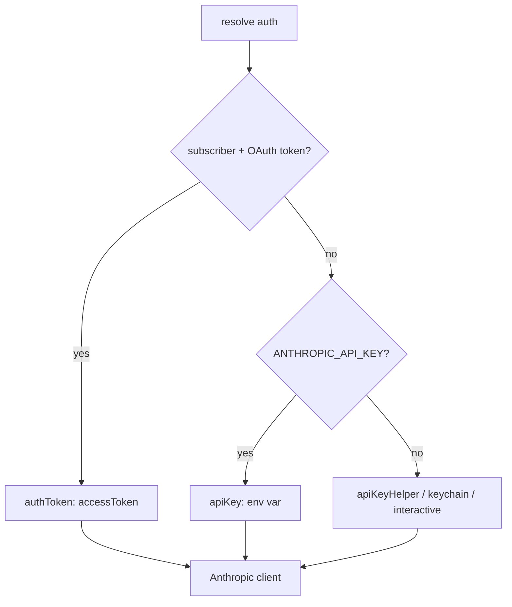

# 07 — Services: API, Auth, Analytics, Cost

> The plumbing under the query loop: how a request reaches the Anthropic API, how retries and
> model fallback work, how auth (OAuth/keychain/API key) is resolved, how feature flags and
> telemetry flow through GrowthBook, and how cost is tracked.

← [06 — Permissions](06-permissions.md) · [Index](README.md) · Next → [08 — MCP](08-mcp.md)

---

## The API call path

`queryModelWithStreaming` (`services/api/claude.ts:752`) is what `query()` calls. It assembles
the request (messages, system blocks, tool schemas, thinking config, beta headers, cache control,
optional `task_budget`), wraps it in `withRetry`, and streams via the Anthropic SDK's
`beta.messages.create`. A **non-streaming fallback** path (`executeNonStreamingRequest`, claude.ts:818)
kicks in on certain overload conditions, with `max_tokens` adjusted to fit the window.

The client (`getAnthropicClient`, `services/api/client.ts`) supports four backends selected by env:
first-party API, **AWS Bedrock**, **GCP Vertex**, **Azure Foundry**. It injects headers (`x-app: cli`,
session id, a client-request-id for timeout correlation) and a custom `fetch` wrapper.

---

## Retry, fallback, and error handling

`withRetry` (`services/api/withRetry.ts`) is a generator wrapping the call with exponential backoff.
Key behaviors:

- **Retryable**: `408/409` (timeout/lock), `429/529` (rate/overload), `401/403` (auth — cache cleared + token refresh), `5xx`.
- **Model fallback**: after `MAX_529_RETRIES` consecutive overloads with a `fallbackModel` configured, it raises `FallbackTriggeredError`, which `query.ts:894` catches to switch models mid-turn.
- **Source-aware**: only "foreground" query sources (REPL main thread, agents, compact, verification) retry aggressively on 529; background sources (suggestions, etc.) bail fast to avoid amplifying a capacity cascade.
- **Fast-mode cooldown**: short `retry-after` retries fast-mode; longer ones cool down to a standard-speed model to preserve the prompt cache.

Error → user message mapping lives in `services/api/errors.ts` (`getAssistantMessageFromError`):
it categorizes (`rate_limit`, `authentication_failed`, `invalid_request`, prompt-too-long, media-size)
and produces friendly text. Prompt-too-long and media errors are tagged so the reactive-compaction
recovery in `query.ts` knows what to do (see [03 — Compaction](03-context-and-prompts.md)).

---

## Prompt caching

`getCacheControl()` (`claude.ts:358`) returns the `cache_control` object placed on system/message
blocks. It decides 1h-TTL eligibility (ant users / subscribers not in overage) and `scope: 'global'`
eligibility (first-party API + no MCP tools). See the prompt-caching section in
[03 — Context & Prompts](03-context-and-prompts.md#prompt-caching--the-constraint-that-shapes-everything)
for why the whole codebase guards prefix stability.

---

## Authentication

- **OAuth 2.0 + PKCE** (`services/oauth/`) — `startOAuthFlow()` opens a browser to a local callback,
  captures the code, exchanges it for `{ accessToken, refreshToken, expiresAt }`. A manual paste-the-code
  fallback exists for headless environments.
- **Token storage** — macOS keychain (per-session entry); `handleOAuth401Error()` refreshes on `401`.
- **API key** — `ANTHROPIC_API_KEY` env var, or an `apiKeyHelper` command, or OS credential manager.
- **Priority** — OAuth (if subscriber) > env API key > helper/keychain.
- Cloud backends (Bedrock/Vertex/Foundry) use their own credential chains; auth errors clear the relevant provider cache.

---

## Analytics & feature flags (GrowthBook + OTel)

- **Feature flags** — `getFeatureValue_CACHED_MAY_BE_STALE(name, default)` (`services/analytics/growthbook.ts`)
  reads a **disk-cached** GrowthBook config (~ms), returning a possibly-stale value rather than blocking
  on the network. The client is keyed on user/session/org attributes and re-initialized when auth changes.
  This is distinct from the build-time `feature('X')` flags (see [13 — Build & Flags](13-build-config-flags.md)).
- **Events** — `logEvent(name, metadata)` (`services/analytics/index.ts`) queues until an analytics sink
  attaches during init, then fans out to Datadog + a first-party logger. Metadata fields are
  type-guarded against accidentally logging code/filepaths (the giant `AnalyticsMetadata_I_VERIFIED_…`
  type name is the enforcement mechanism). PII-tagged fields route to privileged columns.
- **OpenTelemetry** — metrics/traces via OTel SDK + gRPC; lazy-loaded (heavy) and initialized only
  after the trust dialog.

---

## Cost tracking

`src/cost-tracker.ts` accumulates per-model usage; `calculateUSDCost(model, usage)`
(`utils/modelCost.ts`) computes dollars from token counts using per-model pricing tiers, including
cache-read (≈1/10 input) and cache-write (≈5/4 input) pricing and a fast-mode multiplier for Opus.
Totals live in the global state singleton (`getTotalCostUSD`, see [01 — Startup](01-startup.md)) and
surface via `/cost`. Unknown models fall back to a default tier and log a telemetry event.

---

## Key symbols

| Symbol | File:line | Role |
|---|---|---|
| `queryModelWithStreaming` | `services/api/claude.ts:752` | The streaming API entry called by `query()`. |
| `executeNonStreamingRequest` | `services/api/claude.ts:818` | Non-streaming overload fallback. |
| `getAnthropicClient` | `services/api/client.ts` | Builds the SDK client for the active backend. |
| `withRetry` | `services/api/withRetry.ts` | Backoff + auth refresh + model fallback. |
| `FallbackTriggeredError` | `services/api/withRetry.ts` | Signals `query.ts` to switch to `fallbackModel`. |
| `getAssistantMessageFromError` | `services/api/errors.ts` | API error → user-facing message + category. |
| `getCacheControl` | `services/api/claude.ts:358` | Cache breakpoint placement. |
| `getFeatureValue_CACHED_MAY_BE_STALE` | `services/analytics/growthbook.ts` | Disk-cached runtime flag lookup. |
| `logEvent` | `services/analytics/index.ts` | Telemetry event queue. |
| `calculateUSDCost` | `utils/modelCost.ts` | Token usage → USD. |
