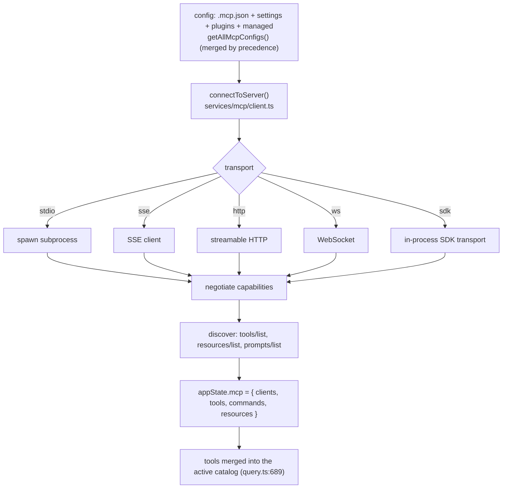
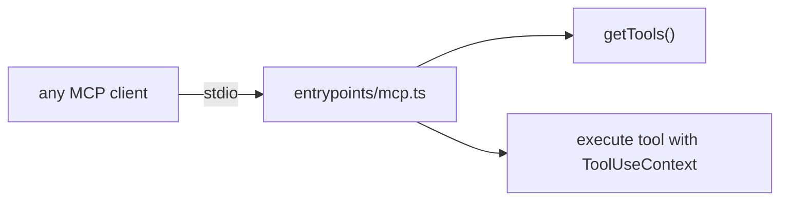

# 08 — MCP Integration

> Model Context Protocol works two ways here: Claude Code as a **client** connecting to external
> MCP servers, and Claude Code as a **server** exposing its own tools. Plus the repo's separate
> source-explorer MCP server.

← [07 — Services](07-services-api-auth.md) · [Index](README.md) · Next → [09 — Agents](09-agents-coordinator-tasks.md)

---

## Client: connecting to external MCP servers

- **Config** comes from `.mcp.json`, user/project settings, plugins, and managed/enterprise configs,
  merged by precedence. Each server config is one of: `stdio`, `sse`, `http`, `ws`, `sdk`, or a
  `claudeai-proxy` relay.
- **Connection states**: `connected` · `failed` · `needs-auth` · `pending` · `disabled`
  (the `MCPServerConnection` union in `services/mcp/types.ts`).
- **Discovery** calls `tools/list`, `resources/list`, `prompts/list`. Tools are normalized to the
  name `mcp__<server>__<tool>`, their descriptions capped (~2048 chars) so a verbose OpenAPI-generated
  server can't blow the context budget, and merged into `appState.mcp.tools`.
- The tool catalog refreshes between turns (`query.ts:1660` via `options.refreshTools()`), so a server
  that connects mid-conversation becomes usable without a restart.

### How external capabilities surface

| MCP concept | Becomes | Surfaced via |
|---|---|---|
| **Tool** (`tools/list`) | A `Tool` named `mcp__server__tool` in the catalog | `MCPTool` template; `client.callTool()` on invoke |
| **Resource** (`resources/list`) | Listable/readable content | `ListMcpResourcesTool`, `ReadMcpResourceTool` |
| **Prompt** (`prompts/list`) | A slash command `/mcp__server__prompt` | command registry (see [05](05-commands.md)) |
| **Auth needed** | A pseudo-tool `mcp__server__authenticate` | `McpAuthTool` → OAuth flow → reconnect |

`MCPTool` output is capped (~100KB) and binary content is persisted to disk rather than streamed
into context.

---

## MCP-related tools

| Tool | Purpose |
|---|---|
| **`MCPTool`** | Template representing a remote MCP tool call; name/description/schema overridden per server. Routes to `ensureConnectedClient()` → `client.callTool()`. |
| **`ListMcpResourcesTool`** | Read-only; lists resources across connected servers (optionally filtered by server). |
| **`ReadMcpResourceTool`** | Read-only; fetches a resource by `{server, uri}`; persists binary blobs. |
| **`McpAuthTool`** | Surfaced for `needs-auth` servers; runs `performMCPOAuthFlow()`, then reconnects and swaps the auth pseudo-tool for the server's real tools. |

---

## Claude Code as an MCP server

`src/entrypoints/mcp.ts` (`claude mcp serve`) runs Claude Code's own tools behind the MCP protocol
over stdio: it implements `ListTools` (from `getTools()`) and `CallTool` (executing with a
`ToolUseContext`), converting Zod schemas to JSON Schema for SDK compliance. This lets *other* MCP
clients (another Claude Code, Claude Desktop, an IDE) call Claude Code's tools.

---

## The source-explorer server (`mcp-server/`, not core)

The repo ships a **separate** MCP server (published to npm as `warrioraashuu-codemaster`) whose only
job is to let an MCP client browse *this leaked source tree*. It is not part of the Claude Code
runtime. It exposes tools like `list_tools`, `list_commands`, `get_tool_source`,
`get_command_source`, `read_source_file`, `search_source`, `list_directory`, `get_architecture`,
and resources like `claude-code://architecture` and `claude-code://source/{path}`. Transports:
stdio (default), HTTP, SSE. See [`mcp-server/README.md`](../../mcp-server/README.md).

---

## Key symbols

| Symbol | File | Role |
|---|---|---|
| `connectToServer` | `services/mcp/client.ts` | Transport factory → `MCPServerConnection`. |
| `ensureConnectedClient` | `services/mcp/client.ts` | Validate/refresh a connected client before RPC. |
| `fetchToolsForClient` / `fetchResourcesForClient` | `services/mcp/client.ts` | Cached discovery; populate `appState.mcp`. |
| `buildMcpToolName` / `mcpInfoFromString` | `services/mcp/mcpStringUtils.ts` | `mcp__server__tool` name encode/decode. |
| `MCPServerConnection` | `services/mcp/types.ts` | Connected \| Failed \| NeedsAuth \| Pending \| Disabled. |
| `performMCPOAuthFlow` | `services/mcp/auth.ts` | OAuth for `needs-auth` servers. |
| `appState.mcp` | `state/AppStateStore.ts` | Single source of truth: clients, tools, commands, resources. |
| `startMCPServer` | `entrypoints/mcp.ts` | Claude Code as an MCP server. |
