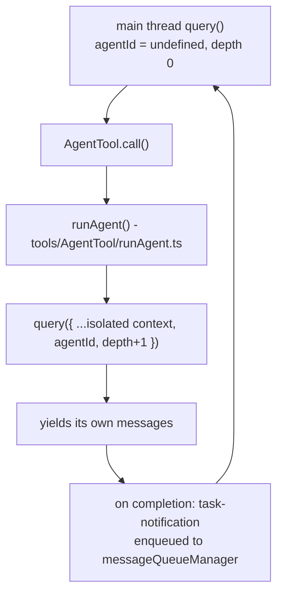
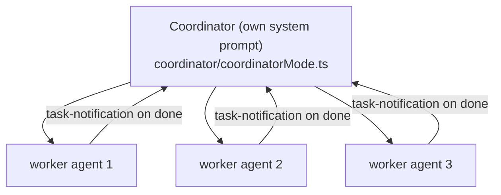
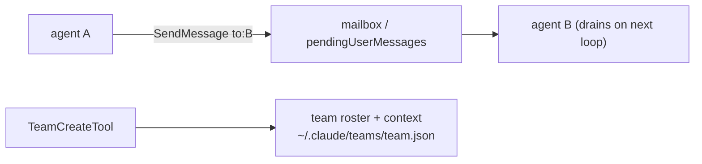

# 09 — Agents, Coordinator, Tasks & Teams

> Claude Code can spawn sub-agents — nested `query()` loops with their own tool sets and context.
> This doc covers `AgentTool`, fork sub-agents, coordinator mode, the task lifecycle, and
> inter-agent messaging/teams.

← [08 — MCP](08-mcp.md) · [Index](README.md) · Next → [10 — UI & State](10-ui-state-rendering.md)

---

## The core idea: agents are nested query loops

A sub-agent is not a separate process by default — it's another invocation of `query()`
(see [02](02-query-loop.md)) running in the same process, distinguished by a unique
`toolUseContext.agentId` and an incremented `queryTracking.depth`.

- **Sync agents** — the parent `await`s `runAgent()`; the parent's turn blocks until the child finishes.
- **Async/background agents** — `registerAsyncAgent()` creates a `LocalAgentTask`, then the child runs
  fire-and-forget. Its result returns later as a `<task-notification>` drained by the main loop on a
  subsequent turn. Auto-backgrounding kicks in for long-running agents.
- **Isolation** — each async agent gets its own `AgentContext` via `AsyncLocalStorage`
  (`utils/agentContext.ts`) so concurrent agents don't clobber each other's telemetry/context.

---

## Agent definitions

`AgentDefinition` (`tools/AgentTool/loadAgentsDir.ts`) describes an agent type: `agentType`,
`whenToUse`, allowed `tools[]` / `disallowedTools[]`, `skills`, `mcpServers`, `hooks`, `model`
(`'inherit'` or an alias), `effort`, `permissionMode`, `maxTurns`, `memory` scope, and `isolation`
(`'worktree'` | `'remote'`). Sources:

- **Built-in** (`builtInAgents.ts`) — e.g. `Explore`, `Plan`; `getSystemPrompt()` is computed per turn.
- **Custom** (`.claude/agents/*.md` + `--agents` JSON) — user/project/policy defined.
- **Plugin** — agents shipped by plugins.

`resolveAgentTools()` (`tools/AgentTool/agentToolUtils.ts`) turns the agent's `tools` (names or `'*'`)
into the actual `Tool[]`, after dedup and permission filtering.

---

## Fork sub-agents

When `AgentTool` is called with **no `subagent_type`** and the `FORK_SUBAGENT` gate is on, it spawns
a *fork*: a child that inherits the parent's **full conversation context** *and* its **rendered
system prompt bytes** (`renderedSystemPrompt`, `Tool.ts:299`). The point is **prompt-cache sharing** —
every fork produces a byte-identical request prefix up to the per-child directive, so forks hit the
cache instead of re-paying for the prompt. `buildForkedMessages()` (`forkSubagent.ts`) clones the
parent's assistant message, adds placeholder tool-results, and appends the fork directive. Recursive
forks are guarded against. Forks always run async (unified task-notification model).

---

## Coordinator mode

`COORDINATOR_MODE` swaps the default system prompt for a coordinator prompt
(`getCoordinatorSystemPrompt`, `coordinator/coordinatorMode.ts`) whose job is to *orchestrate*
workers (spawned via `AgentTool`) for research/implementation/verification. Workers run async and
**notify the coordinator on completion** rather than the coordinator polling them ("do not use one
worker to check on another"). Coordinator mode and fork sub-agents are mutually exclusive — the
coordinator owns orchestration.

---

## Tasks

Async agents (and other long-running work) are modeled as **tasks** in `src/tasks/`. `TaskState`
(`tasks/types.ts`) is a union covering local shell tasks, local agent tasks, remote agent tasks,
in-process teammates, workflows, and monitors. Task state lives in `AppState.tasks[taskId]` so it
survives backgrounding. The Task v2 tools (`TaskCreate/Get/Update/List/Stop/Output`) let the model
create and inspect tasks. On completion, `enqueueAgentNotification()` builds the `<task-notification>`
block and pushes it to the **message queue manager** (`utils/messageQueueManager.ts`), a
process-global priority queue (`now` > `next` > `later`) drained by the main loop — which is also how
queued user prompts and orphaned permission requests re-enter the conversation.

---

## Teams & inter-agent messaging

- **`TeamCreateTool` / `TeamDeleteTool`** — create/tear down a team (roster, lead, shared context).
- **`SendMessageTool`** — `{to, message, summary}`. For in-process teammates it queues into the
  target's `pendingMessages`, drained when that teammate's loop next checks; for separate processes
  (e.g. tmux teammates) it writes to a mailbox file the target polls.
- **Team memory sync** (`utils/teamMemorySync/`) — a shared knowledge base across team members
  (see [12 — Memory](12-plugins-skills-memory.md)).

---

## Concurrency model at a glance

| Mode | Where it runs | Can show UI? | Result path |
|---|---|---|---|
| Sync sub-agent | in-process, blocks parent | via parent | returned directly to the tool result |
| Async/background agent | in-process, fire-and-forget | no | `<task-notification>` via message queue |
| Fork sub-agent | in-process, async | no | task-notification (cache-shared prefix) |
| In-process teammate | in-process, own loop | yes (shares terminal) | mailbox / pendingMessages |
| Remote agent (ant) | CCR / teleport | n/a | taskId + session URL |

---

## Key symbols

| Symbol | File | Role |
|---|---|---|
| `AgentTool` | `tools/AgentTool/AgentTool.tsx` | Spawns sub-agents (sync/async/fork). |
| `runAgent` | `tools/AgentTool/runAgent.ts` | Runs a sub-agent's `query()` loop, yields its messages. |
| `AgentDefinition` / `loadAgentsDir` | `tools/AgentTool/loadAgentsDir.ts` | Agent type schema + loader. |
| `buildForkedMessages` | `tools/AgentTool/forkSubagent.ts` | Fork context cloning for cache sharing. |
| `getCoordinatorSystemPrompt` | `coordinator/coordinatorMode.ts` | Coordinator-mode prompt. |
| `messageQueueManager` | `utils/messageQueueManager.ts` | Process-global priority queue (notifications, prompts). |
| `TaskState` | `tasks/types.ts` | The task union; lives in `AppState.tasks`. |
| `SendMessageTool` / `TeamCreateTool` | `tools/SendMessageTool/`, `tools/TeamCreateTool/` | Inter-agent messaging + teams. |
| `AsyncLocalStorage<AgentContext>` | `utils/agentContext.ts` | Per-agent isolation. |
