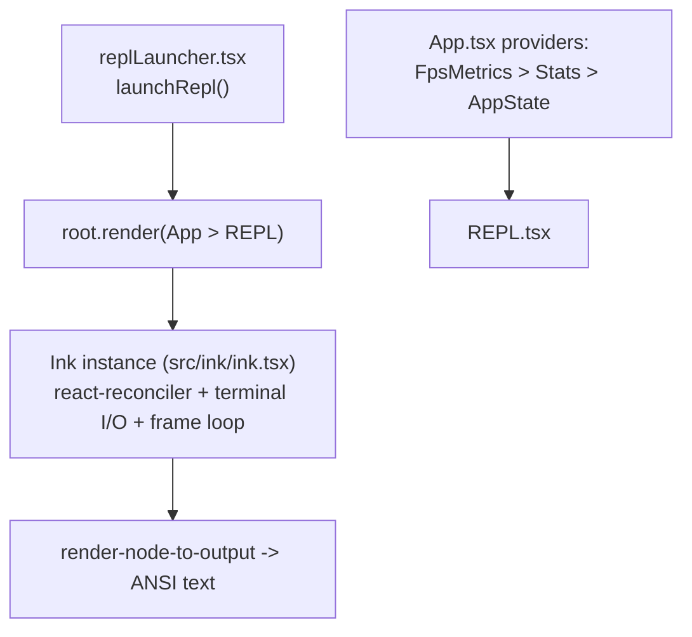
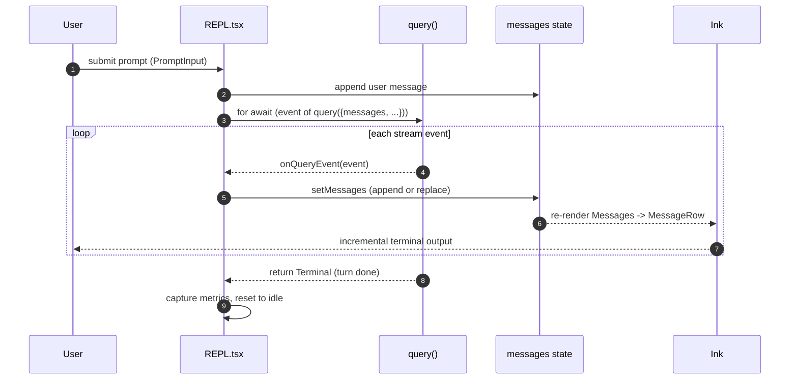
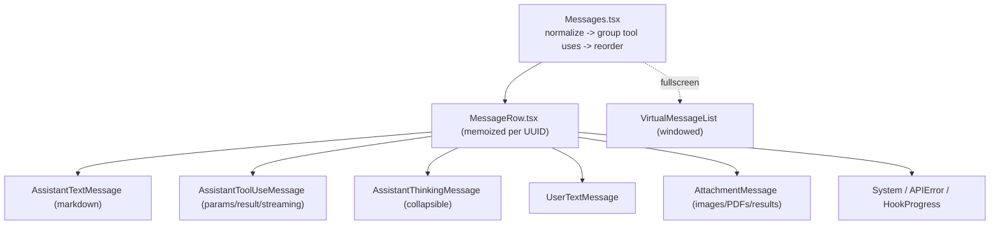

# 10 — UI, State & Rendering

> Claude Code's UI is React rendered to the terminal via Ink. This doc covers the renderer, the
> REPL's consumption of the `query()` stream, the AppState store, message rendering, and input.

← [09 — Agents](09-agents-coordinator-tasks.md) · [Index](README.md) · Next → [11 — Bridge & Remote](11-bridge-remote-server.md)

---

## React, in a terminal

The entire UI is React components rendering to the terminal via **Ink** (`src/ink/`), a custom
React reconciler that lays out `Box`/`Text` nodes and paints them as ANSI text. A `ThemeProvider`
wraps every render; a frame loop repaints on a fixed interval.



---

## The REPL: consuming the query stream

`src/screens/REPL.tsx` (~5,000 lines) is the main interactive screen. On each user submission it
calls `query(...)` and consumes the yielded events:



- **`onQueryEvent`** routes each event through `handleMessageFromStream` (`utils/messages.ts`),
  which turns raw stream events into `Message` objects and fires callbacks.
- **Append vs. replace**: normal messages are appended; *ephemeral* progress messages (Bash/Sleep
  ticks) are **replaced** in place to avoid unbounded array growth.
- **Compact boundaries** reset the message list and bump a `conversationId` so React remounts the
  rows (clearing stale memoization).
- **Streaming separation**: in-progress thinking and tool-use blocks are held in separate streaming
  state and merged into `messages` only when complete.

---

## State management — the AppState store

There are **two** state systems; don't confuse them (see also [01 — Startup](01-startup.md#global-state-singleton--srcbootstrapstatets)):

| Store | Where | Reactive? | Holds |
|---|---|---|---|
| **`AppState`** | `state/AppStateStore.ts` + `state/AppState.tsx` | Yes (React) | UI-reactive state: settings, model, permission context, MCP state, tasks, notifications, view mode |
| **`bootstrap/state.ts`** | module singleton | No | Process-global: session id, cwd, cost counters, model override |

The AppState store is a tiny subscription store (`state/store.ts`): `createStore(initial, onChange)`
→ `{ getState, setState, subscribe }`. Components subscribe with `useAppState(selector)` via
`useSyncExternalStore`, so a component only re-renders when *its* slice changes (`Object.is` gating).

```mermaid
flowchart LR
    TOOLS["tools / query loop"] -->|getAppState / setAppState| STORE["AppState store"]
    STORE -->|useAppState(selector)| COMP["React components (fine-grained re-render)"]
    STORE --> ONCHANGE["onChangeAppState.ts<br/>side-effects: e.g. sync permission mode to CCR/SDK"]
```

`onChangeAppState.ts` is the single choke point for side-effects on state change (e.g. when the
permission mode changes, it notifies the bridge/SDK). Tools reach state through
`toolUseContext.getAppState()` — that's the bridge between the non-React engine and the React UI.

### Context providers (`src/context/`)
`AppState`, `FpsMetrics`, `Stats` (token/cost aggregation), `notifications` (toasts),
`overlay`/`modal`/`promptOverlay` (dialogs), `QueuedMessage` + `mailbox` (teammate messaging),
and `voice` (ant-only, eliminated from external builds).

---

## Message rendering



`Messages.tsx` normalizes the raw list (drops compact boundaries, groups adjacent tool-use/result
pairs), then renders each via a type-specific component. A `VirtualMessageList` provides windowed
rendering + search in fullscreen mode.

---

## Input handling

`PromptInput` composes several hooks:

| Hook | Role |
|---|---|
| `useTextInput` | Cursor, history, kill-ring (Emacs-style editing). |
| `useVimInput` | Vim normal/insert state machine wrapping `useTextInput`. |
| `usePasteHandler` | Large-paste coalescing, clipboard image extraction, drag-drop file paths. |
| `useKeybinding` / `useGlobalKeybindings` | User-configurable + global key handlers. |

Submission → `handlePromptSubmit` (`utils/handlePromptSubmit.ts`) → appends a user message and
kicks the query.

---

## Print / non-interactive mode

`src/cli/print.ts` is the headless path (`-p`). It runs the same `query()` but **does not render
with Ink** — instead it accumulates messages and emits text or JSON (`stream-json` for SDK
consumers) to stdout. It runs post-turn hooks synchronously and doesn't mutate React state. Same
engine, different sink.

---

## Key symbols

| Symbol | File:line | Role |
|---|---|---|
| `launchRepl` | `replLauncher.tsx` | Mount the App + REPL tree. |
| `onQueryEvent` | `screens/REPL.tsx` | Consume `query()` stream events → update messages. |
| `handleMessageFromStream` | `utils/messages.ts` | Stream events → `Message` objects + callbacks. |
| `createStore` / `useAppState` | `state/store.ts`, `state/AppState.tsx` | The subscription store + selector hook. |
| `onChangeAppState` | `state/onChangeAppState.ts` | Side-effects on state change. |
| `Messages` / `MessageRow` | `components/` | Message list + per-message rendering. |
| `useTextInput` / `useVimInput` / `usePasteHandler` | `hooks/` | Input editing stack. |
| `print` | `cli/print.ts` | Headless/SDK output path. |
