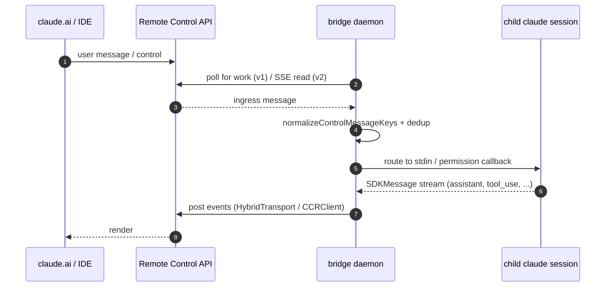

# 11 — Bridge, Remote & Server

> Three different ways a Claude Code session can be driven from outside the terminal: the IDE/web
> **bridge** (Remote Control / CCR), **remote sessions** (desktop/mobile handoff), and **server
> mode** (local PTY server). They look similar but are distinct subsystems.

← [10 — UI & State](10-ui-state-rendering.md) · [Index](README.md) · Next → [12 — Plugins, Skills, Memory](12-plugins-skills-memory.md)

---

## Three surfaces at a glance

```mermaid
flowchart TB
    subgraph BR["Bridge (src/bridge) — CCR"]
        WEB["claude.ai / IDE / mobile"] <-->|"Remote Control API + WS"| BRG["bridge daemon"]
        BRG <-->|stdin/stdout + control msgs| SESS["child claude session(s)"]
    end
    subgraph RM["Remote (src/remote)"]
        DESK["desktop / mobile app"] <-->|"WebSocket /v1/sessions/ws"| CCRSESS["existing CCR session"]
    end
    subgraph SV["Server (src/server)"]
        LOCAL["local WS client"] <-->|"/sessions/ws (PTY)"| PTY["node-pty session"]
    end
```

| Subsystem | What it is | Transport | Direction |
|---|---|---|---|
| **Bridge** (`src/bridge/`) | A local daemon that polls the Remote Control (CCR) service for work and **spawns child `claude` sessions**, bridging their stdio + permission prompts to a web/IDE client. | Environments API poll + WebSocket ingress (v1) or direct OAuth→session→SSE (v2) | bidirectional |
| **Remote** (`src/remote/`) | A WebSocket client to an **already-running** CCR session (desktop/mobile cowork/handoff). | WebSocket `/v1/sessions/ws/{id}/subscribe` | peer |
| **Server** (`src/server/`) | A standalone PTY server exposing local sessions over WebSocket, with rate limits and a crash-recovery index. | local `/sessions/ws` | peer |

---

## The bridge (CCR / Remote Control)

- **Activation** — `isBridgeEnabled()` (`bridge/bridgeEnabled.ts`) gates on a GrowthBook flag +
  subscriber status; `feature('BRIDGE_MODE')` gates it out of external builds at compile time.
- **Two implementations** — *v1* (env-based): a long-lived daemon polling the Environments API and
  dispatching work (`bridgeMain.ts`, `replBridge.ts`). *v2* (env-less): direct OAuth → create session
  → `/bridge` endpoint → SSE read + CCR write (`remoteBridgeCore.ts`), REPL-only.
- **Protocol** — messages are the SDK `SDKMessage` discriminated union (user/assistant/system/
  tool_use/tool_result/control_request/control_response). `handleIngressMessage`
  (`bridgeMessaging.ts`) parses, normalizes key casing (mobile clients send camelCase), routes by
  type, and dedups by UUID. Outbound goes through a `ReplBridgeTransport` abstraction (v1
  HybridTransport WS-POST vs v2 SSETransport + CCRClient), with an SSE high-water mark so a transport
  swap resumes instead of replaying from zero.
- **Auth (JWT)** — `jwtUtils.ts` decodes the `exp` claim and proactively refreshes ~5 min before
  expiry, delivering fresh tokens to the transport. Bridge API calls carry `Authorization: Bearer`
  and retry once on `401`.
- **Permission routing** — `bridgePermissionCallbacks.ts`: a `control_request` carries the tool +
  input to the web client; a `control_response` returns `{ behavior: 'allow'|'deny', updatedInput?,
  updatedPermissions? }`. This is how a browser can answer the permission prompt the CLI would
  otherwise show in the terminal.
- **Crash recovery** — a "bridge pointer" file lets a restarted session re-attach; recovery can
  fan out across worktree siblings.

---

## Remote sessions (`src/remote/`)

A *different* protocol for desktop/mobile cowork. `RemoteSessionManager` opens a WebSocket
(`SessionsWebSocket`) to an existing CCR session at `/v1/sessions/ws/{id}/subscribe`, authenticated
with an OAuth bearer token. It receives the `SDKMessage` + control stream and posts user messages via
HTTP. Reconnect uses bounded backoff; permanent close codes (e.g. unauthorized) stop retrying.
Unlike the bridge, it does **not** spawn child sessions — it's a viewer/driver of a server-side
session.

---

## Server mode (`src/server/`)

A standalone server that spawns **node-pty pseudo-terminals**, one per WebSocket client, exposing
local sessions over `/sessions/ws`. `SessionManager` enforces per-user rate limits (e.g. sessions
per hour), concurrent-session caps, and a session index for resumption across restarts. States:
`starting → running → detached → stopping → stopped`. `DirectConnectSessionManager` wraps a session
for a direct WebSocket client, parsing inbound control requests (permission prompts) and forwarding
SDK messages. This is **local** — clients connect to this process, not to CCR.

---

## Key symbols

| Symbol | File | Role |
|---|---|---|
| `isBridgeEnabled` / `isBridgeEnabledBlocking` | `bridge/bridgeEnabled.ts` | Runtime gate (GrowthBook + OAuth). |
| `handleIngressMessage` | `bridge/bridgeMessaging.ts` | Parse/normalize/route/dedup inbound messages. |
| `ReplBridgeTransport` | `bridge/replBridgeTransport.ts` | v1/v2 transport abstraction. |
| `createTokenRefreshScheduler` | `bridge/jwtUtils.ts` | Proactive JWT refresh. |
| `BridgePermissionResponse` | `bridge/bridgePermissionCallbacks.ts` | allow/deny + updated input/permissions. |
| `RemoteSessionManager` / `SessionsWebSocket` | `remote/` | Desktop/mobile session over WebSocket. |
| `SessionManager` / `DirectConnectSessionManager` | `server/` | PTY server + direct-connect wrapper. |
