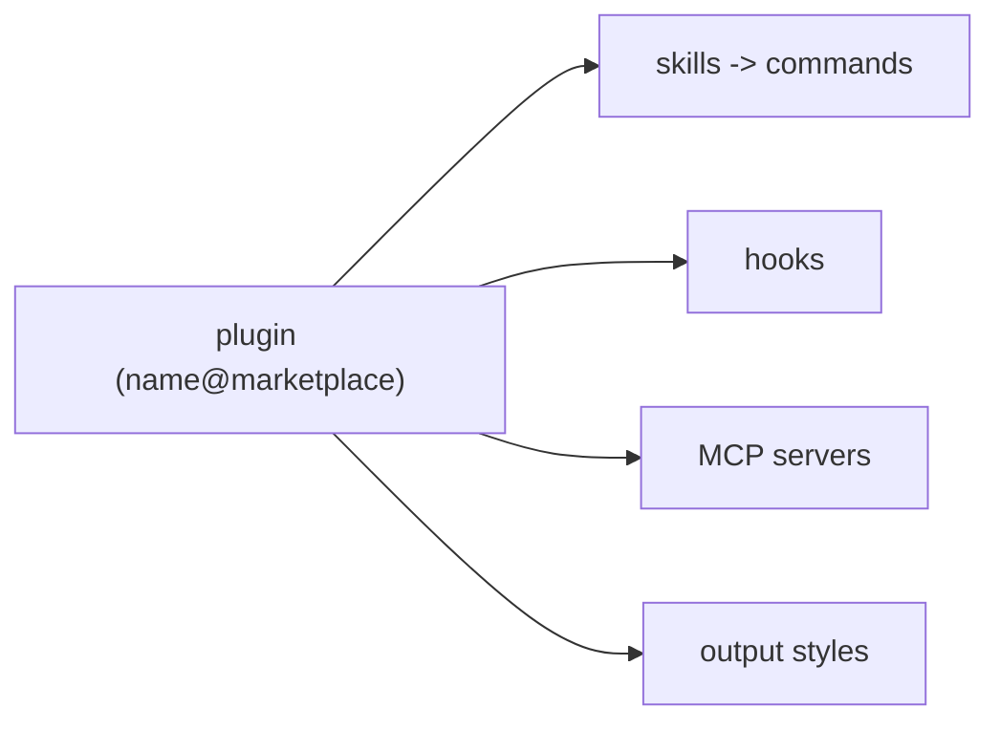
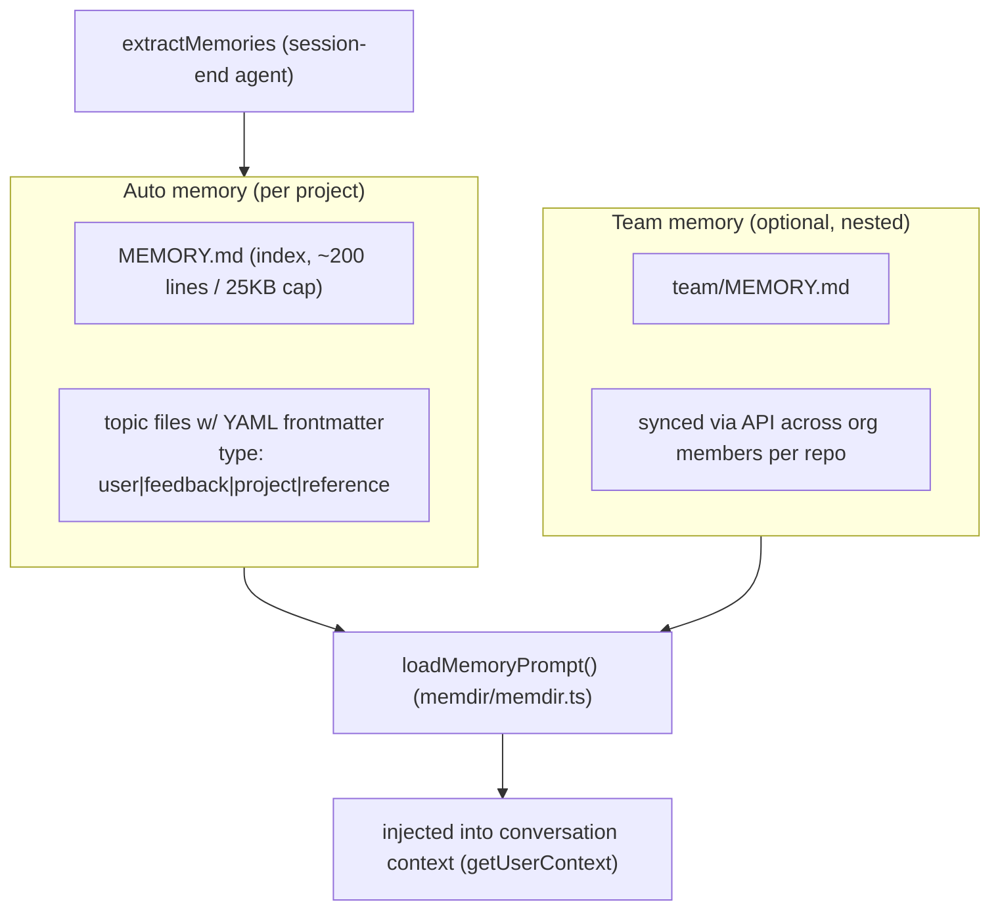

# 12 — Plugins, Skills, Memory & Output Styles

> The extensibility surfaces (skills, plugins) and the persistent memory system, plus output styles
> that reshape the system prompt.

← [11 — Bridge & Remote](11-bridge-remote-server.md) · [Index](README.md) · Next → [13 — Build & Config](13-build-config-flags.md)

---

## Skills

A **skill** is a reusable prompt-command (markdown with frontmatter) the model can invoke via the
`SkillTool`, or a user can run as a slash command.

```mermaid
flowchart TD
    SRC1["bundled skills<br/>registerBundledSkill()"] --> REG
    SRC2[".claude/skills/*.md<br/>loadSkillsDir.ts"] --> REG
    SRC3["plugin skills"] --> REG
    REG["command registry (commands.ts)"] --> TOOL["SkillTool"]
    TOOL --> MODE{execution mode}
    MODE -->|inline| INL["expand prompt + allowedTools + model override<br/>into the current context"]
    MODE -->|fork| FRK["spawn isolated sub-agent<br/>(own token budget) - see 09"]
    MODE -->|remote (ant)| RMT["load from cache, inject as user message"]
```

- **Sources** — bundled (compiled in via `registerBundledSkill`, `src/skills/bundledSkills.ts`),
  on-disk (`.claude/skills/`, user, policy dirs via `loadSkillsDir.ts`), and plugin skills.
- **Frontmatter** — `name`, `description`, `whenToUse`, optional `model`, `effort`, `allowedTools`, `hooks`.
- **Execution** (`tools/SkillTool/SkillTool.ts`) — *inline* (expand into the current turn), *forked*
  (isolated sub-agent with its own budget; `addInvokedSkill()` records it so compaction preserves it),
  or *remote* (ant-only experimental).
- **Skill search** (`EXPERIMENTAL_SKILL_SEARCH`) — background discovery/prefetch of relevant skills,
  injected as attachments (see [03 — Attachments](03-context-and-prompts.md#attachments--prefetch-extra-context-injected-mid-turn)).

---

## Plugins

A **plugin** bundles skills, hooks, MCP servers, and/or output styles under one source id
(`name@marketplace`).

- **Built-in plugins** — registered in `src/plugins/builtinPlugins.ts`; enabled/disabled via
  `settings.enabledPlugins` with a `defaultEnabled` fallback.
- **Loading** — `src/services/plugins/pluginOperations.ts` (pure install/enable/disable/update
  operations) + `utils/plugins/pluginLoader.ts` (read manifests/metadata).
- **What they extend** — skills (→ commands), hooks (auto-injected), MCP servers (loaded at startup),
  output styles (can be force-applied while the plugin is enabled).



---

## Memory

File-based, directory-scoped persistent memory with an optional shared team layer.



- **Location** — `~/.claude/projects/{git-root-hash}/memory/` (overridable). `MEMORY.md` is the index
  loaded into every conversation; topic files carry frontmatter (`name`, `description`, `type`, tags).
- **Loading** — `loadMemoryPrompt()` (`memdir/memdir.ts`) builds the memory section of the prompt
  (dispatching to KAIROS daily-log / combined team / plain variants by feature flag), entrypoint
  truncated to a line + byte cap.
- **Extraction** — `services/extractMemories/` runs a background agent at session end (`EXTRACT_MEMORIES`)
  to scan the conversation for memory-worthy facts.
- **Team sync** — `services/teamMemorySync/` pulls at session start and pushes at session end
  (ETag-tracked, delta uploads), with a secret scanner blocking sensitive data and deletions that
  don't propagate. Team vs. private scope is tagged in frontmatter.

---

## Output styles

Output styles (`src/constants/outputStyles.ts`, e.g. `default`, `Explanatory`, `Learning`) are
system-prompt overrides with optional `keepCodingInstructions`. Resolution
(`getOutputStyleConfig`): forced plugin style → `settings.outputStyle` → built-in default. Custom
styles can be defined in `.claude/output-styles/*.md`. The selected style is injected as the
`# Output Style` section of the system prompt (see [03](03-context-and-prompts.md)).

---

## Key symbols

| Symbol | File | Role |
|---|---|---|
| `registerBundledSkill` | `skills/bundledSkills.ts` | Register a compiled-in skill. |
| `loadSkillsDir` | `skills/loadSkillsDir.ts` | Load on-disk skills. |
| `SkillTool` | `tools/SkillTool/SkillTool.ts` | Inline/fork/remote skill execution. |
| `getBuiltinPlugins` | `plugins/builtinPlugins.ts` | Enabled/disabled plugin resolution. |
| `loadMemoryPrompt` | `memdir/memdir.ts` | Build the memory prompt section. |
| `getAutoMemPath` | `memdir/paths.ts` | Resolve the memory directory. |
| `getOutputStyleConfig` | `constants/outputStyles.ts` | Resolve the active output style. |
