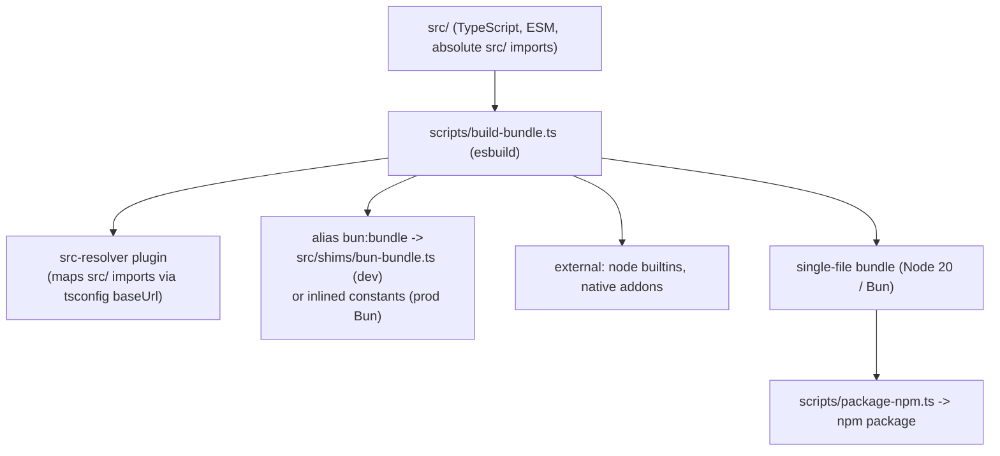
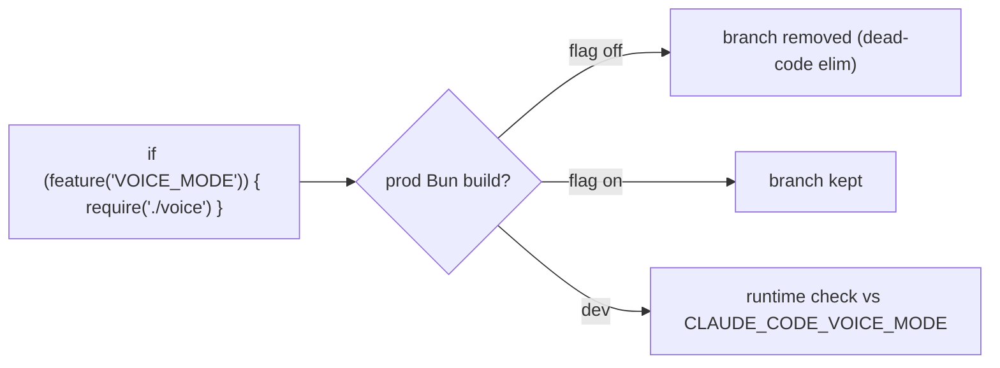
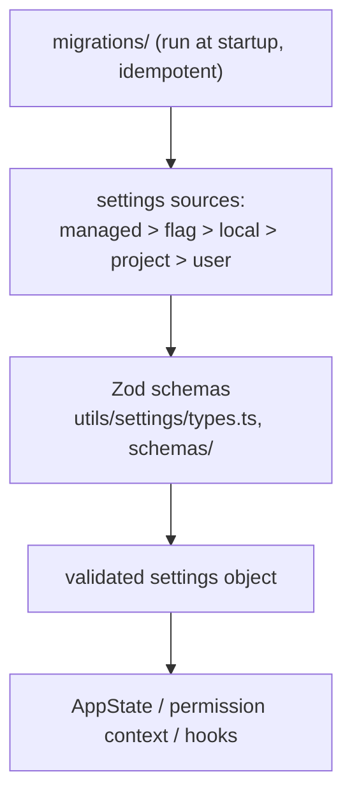

# 13 — Build System, Feature Flags & Config

> How the source becomes a runnable binary, how `bun:bundle` feature flags strip dead code, and how
> settings are validated (Zod) and migrated across versions.

← [12 — Plugins, Skills, Memory](12-plugins-skills-memory.md) · [Index](README.md)

---

## Build pipeline

- **Entry**: `scripts/build-bundle.ts` configures esbuild (Node 20 target, ESM, single file, tree-shaking).
- **`src/` imports** are resolved by a plugin honoring `tsconfig.json`'s `baseUrl: "."` (so
  `src/foo/bar.js` resolves to the TS source).
- **Dev vs prod**: `bun run build` (esbuild) vs `build:prod` (`--minify`). `scripts/dev.ts` runs the
  CLI in dev mode; `scripts/package-npm.ts` produces the publishable package.
- **Runtime**: Bun (`engines.bun >= 1.1.0`), which gives native TSX and the `bun:bundle` macro.

> This leaked tree has a community-added secondary build path (`scripts/bun-plugin-shims.ts`,
> runtime shims, the `prompts/` rebuild guide) for running it **outside** Anthropic's Bun toolchain.
> That scaffolding is *not* part of the original CLI — see the repo root `prompts/` and `docker/`.

---

## Feature flags — build-time dead-code elimination

`feature('X')` is imported from `bun:bundle`. In production Bun builds, each call is replaced by a
constant at bundle time, so `if (feature('X')) { ... }` branches that are off get **tree-shaken
away entirely** — the code (and its string literals) never ships. In dev, a shim
(`src/shims/bun-bundle.ts`) reads `CLAUDE_CODE_X` env vars with defaults.

This is *different* from GrowthBook runtime flags (see [07 — Services](07-services-api-auth.md)):
`feature()` is compile-time (what ships), GrowthBook is runtime (what's enabled for this user/session).

### Notable flags

| Flag | Gates |
|---|---|
| `PROACTIVE` / `KAIROS` | Proactive/assistant autonomous modes |
| `BRIDGE_MODE` | IDE/web bridge ([11](11-bridge-remote-server.md)) |
| `COORDINATOR_MODE` | Multi-agent coordinator ([09](09-agents-coordinator-tasks.md)) |
| `FORK_SUBAGENT` | Fork sub-agents ([09](09-agents-coordinator-tasks.md)) |
| `VOICE_MODE` | Voice I/O |
| `CONTEXT_COLLAPSE` / `HISTORY_SNIP` / `REACTIVE_COMPACT` / `CACHED_MICROCOMPACT` | Compaction strategies ([03](03-context-and-prompts.md)) |
| `TOKEN_BUDGET` | `+500k`-style auto-continue ([02](02-query-loop.md)) |
| `EXPERIMENTAL_SKILL_SEARCH` | Skill discovery/prefetch ([12](12-plugins-skills-memory.md)) |
| `EXTRACT_MEMORIES` / `TEAMMATE` | Memory extraction + team memory ([12](12-plugins-skills-memory.md)) |
| `WORKFLOW_SCRIPTS` | Workflow commands |
| `AGENT_TRIGGERS` / `MONITOR_TOOL` / `BG_SESSIONS` | Scheduling, monitoring, background sessions |
| `BREAK_CACHE_COMMAND` | Cache-breaking debug tool (ant) |

(Flags are read across the codebase; this is a representative, not exhaustive, list.)

---

## Config schemas & migrations

- **Validation** — settings are Zod-validated (`utils/settings/types.ts`, `schemas/`). Hook schemas
  live in `schemas/hooks.ts` (command/prompt/HTTP hooks, with `if` conditions in permission-rule syntax).
  `lazySchema()` avoids circular-dependency issues at module load.
- **Sources & precedence** — managed/policy (highest) → flag → local (`.claude/settings.local.json`)
  → project (`.claude/settings.json`) → user (`~/.claude/settings.json`).
- **Migrations** — `src/migrations/` holds idempotent transforms run at startup (e.g. remapping model
  aliases on upgrade, moving a setting from global config into `settings.json`). Each checks state and
  only writes if needed.

### Config storage locations

| Path | Holds |
|---|---|
| `~/.claude/.claude` | App state (auth, telemetry opt-in) |
| `~/.claude/settings.json` | User settings (prefs, plugins, hooks) |
| `.claude/settings.json` | Project settings (committed) |
| `.claude/settings.local.json` | Local/session overrides (gitignored) |
| managed settings file | Admin-controlled (enterprise) |

---

## Key symbols

| Symbol | File | Role |
|---|---|---|
| build entry | `scripts/build-bundle.ts` | esbuild config, `src-resolver`, `bun:bundle` alias. |
| `feature` | `bun:bundle` (shim: `src/shims/bun-bundle.ts`) | Build-time flag → dead-code elimination. |
| settings schema | `utils/settings/types.ts`, `schemas/` | Zod validation of all config. |
| migrations | `src/migrations/` | Idempotent config upgrades at startup. |
| `lazySchema` | schema utils | Break circular deps in schema definitions. |

---

## That's the whole engine

You've now got the full picture: [boot](01-startup.md) → [the loop](02-query-loop.md) →
[what it sends the model](03-context-and-prompts.md) → [tools](04-tools.md) /
[commands](05-commands.md) gated by [permissions](06-permissions.md), riding on
[services](07-services-api-auth.md), extended by [MCP](08-mcp.md),
[agents](09-agents-coordinator-tasks.md), and [skills/plugins/memory](12-plugins-skills-memory.md),
rendered by [React+Ink](10-ui-state-rendering.md), reachable via
[bridge/remote/server](11-bridge-remote-server.md), and shipped by this build system.
Back to the [Index](README.md).
