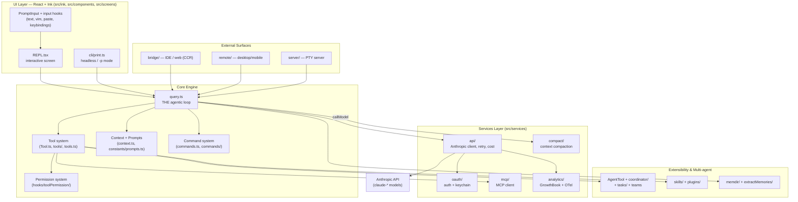
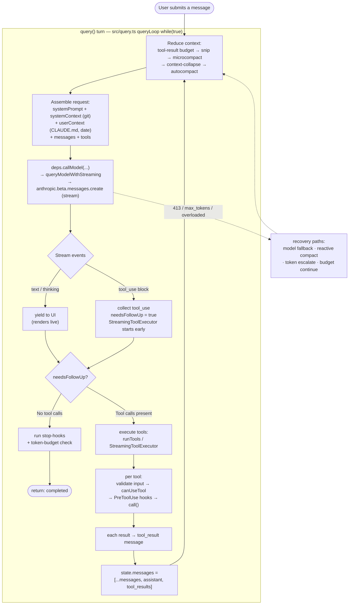
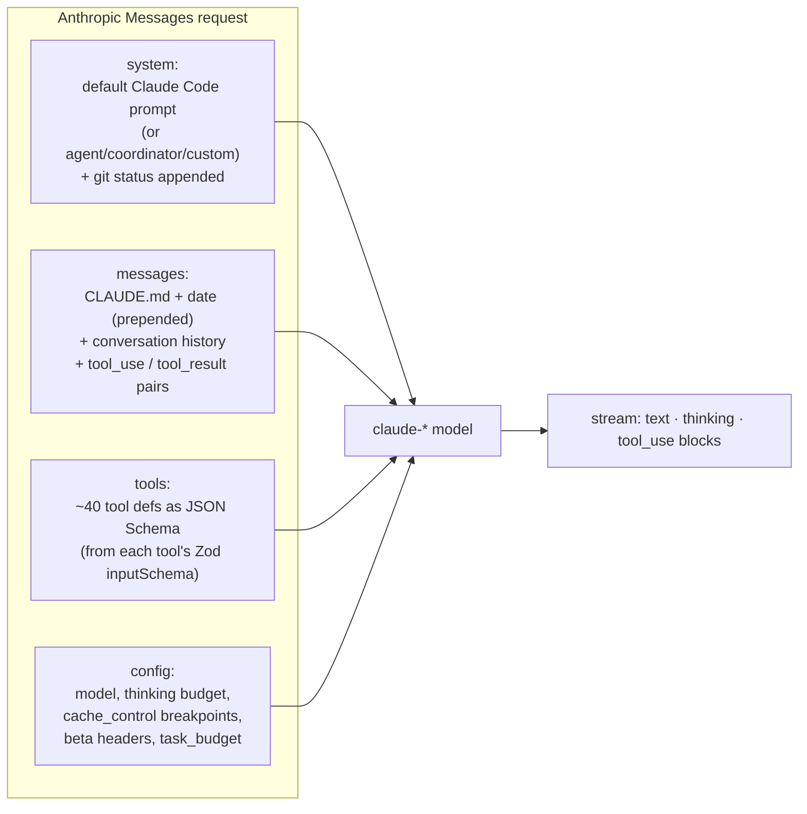

# Claude Code — Internal Architecture (Deep Dive)

> A complete, code-grounded explanation of how the Claude Code CLI works internally:
> how it boots, how it talks to the LLM, how tools run, how permissions gate them,
> how context is kept inside the window, and how every subsystem fits together.

This is the **deep-dive** companion to the higher-level [`docs/architecture.md`](../architecture.md).
It is written for someone who wants to *understand or modify* the engine, not just use it.

---

## How to read this

Start here for the big picture and the master diagrams, then jump into any subsystem doc.
The **single most important file in the whole codebase is `src/query.ts`** — the agentic
loop. If you only read one deep-dive, read [02 — The Query Loop](02-query-loop.md).

| # | Doc | What it covers |
|---|-----|----------------|
| 00 | **this file** | Master diagrams, layer model, glossary, the 60-second mental model |
| 01 | [Startup & Entrypoints](01-startup.md) | `claude` → REPL: boot sequence, entrypoints, parallel prefetch, CLI flags, global state |
| 02 | [The Query Loop (LLM engine)](02-query-loop.md) | The agentic `while(true)` loop, turn lifecycle, streaming, recovery paths |
| 03 | [Context & Prompts](03-context-and-prompts.md) | System prompt assembly, context gathering, prompt caching, the 5-layer compaction stack |
| 04 | [Tool System](04-tools.md) | The `Tool` contract, registry, schema→API, parallel execution, deferred tools |
| 05 | [Command System](05-commands.md) | Slash commands: the 3 command types, dispatch, prompt-commands → LLM |
| 06 | [Permission System](06-permissions.md) | Permission modes, the decision pipeline, rules, the auto classifier, hooks |
| 07 | [Services: API, Auth, Analytics, Cost](07-services-api-auth.md) | Anthropic client, retry/fallback, OAuth/keychain, GrowthBook, cost tracking |
| 08 | [MCP Integration](08-mcp.md) | Client (connecting to servers) + Claude Code as a server + the explorer server |
| 09 | [Agents, Coordinator, Tasks, Teams](09-agents-coordinator-tasks.md) | Sub-agents, forks, coordinator mode, task lifecycle, inter-agent messaging |
| 10 | [UI, State & Rendering](10-ui-state-rendering.md) | React + Ink, AppState store, message rendering, input handling |
| 11 | [Bridge, Remote & Server](11-bridge-remote-server.md) | IDE/web bridge (CCR), remote desktop/mobile sessions, PTY server mode |
| 12 | [Plugins, Skills, Memory, Output Styles](12-plugins-skills-memory.md) | Extensibility + persistent memory |
| 13 | [Build System, Feature Flags, Config](13-build-config-flags.md) | esbuild/Bun bundle, `bun:bundle` dead-code elimination, Zod schemas, migrations |

> **Note on line numbers.** File:line references throughout these docs are navigation
> anchors against this snapshot of the source. The structure is reliable; exact line
> numbers may drift by a few lines. When in doubt, grep for the named symbol.
>
> **Note on era.** This source predates Opus 4.8 — the prompt hardcodes
> `FRONTIER_MODEL_NAME = 'Claude Opus 4.6'` (`src/constants/prompts.ts:118`). Treat model
> IDs as a point-in-time snapshot.

---

## The 60-second mental model

Claude Code is **not a chatbot with some commands bolted on**. It is an *agentic loop*:

1. You type something. It becomes a `user` message.
2. The loop builds a request — **system prompt + context + full message history + the tool catalog** — and streams it to the Anthropic API.
3. The model streams back text and/or **tool-use requests** (structured "please run Bash with these args").
4. The loop **executes those tools locally**, turns each result into a `tool_result` message, appends them to the history, and **calls the model again**.
5. Repeat until the model responds with *no* tool requests. That's the end of the turn.

Everything else — the React/Ink terminal UI, the permission prompts, MCP servers, sub-agents,
compaction, the IDE bridge — is machinery hanging off that five-step spine. The model never
touches your machine directly; it only emits structured requests that **the loop** chooses to
execute (after permission checks).

---

## Layer model

---

## Master diagram: one user turn, end to end

This is the core control flow. Every box maps to real code in `src/query.ts` unless noted.

The two arrows that *make it an agent*:
- **`APPEND → ASM`** (`src/query.ts:1714`): tool results are appended to history and the loop repeats.
- **`DONE → STOPHOOK → COMPLETE`** (`src/query.ts:1062`): when the model stops asking for tools, the turn ends.

---

## What actually gets sent to the LLM

Sources:
- **System prompt** — `src/utils/systemPrompt.ts:41` (`buildEffectiveSystemPrompt`); text in `src/constants/prompts.ts`.
- **System context** (git status) — `src/context.ts:116` (`getSystemContext`), appended at `query.ts:449`.
- **User context** (CLAUDE.md + date) — `src/context.ts:155` (`getUserContext`), prepended at `query.ts:660`.
- **Tools** — Zod schema → JSON Schema via `zodToJsonSchema()` (cached); see [04 — Tool System](04-tools.md).
- **Prompt caching** — a hard design constraint; the `SYSTEM_PROMPT_DYNAMIC_BOUNDARY` marker (`prompts.ts:114`) splits cacheable-static from session-dynamic. See [03 — Context & Prompts](03-context-and-prompts.md).

---

## Subsystem map (where things live)

| Directory | Role | Deep-dive |
|---|---|---|
| `entrypoints/`, `bootstrap/` | Process boot, CLI parse, global state | [01](01-startup.md) |
| `query.ts`, `query/`, `QueryEngine.ts` | The agentic loop & SDK wrapper | [02](02-query-loop.md) |
| `context.ts`, `constants/prompts.ts`, `services/compact/` | Prompts, context, compaction | [03](03-context-and-prompts.md) |
| `Tool.ts`, `tools/`, `tools.ts`, `services/tools/` | Tool contract, registry, execution | [04](04-tools.md) |
| `commands.ts`, `commands/` | Slash commands | [05](05-commands.md) |
| `hooks/toolPermission/`, `utils/permissions/` | Permission decisions | [06](06-permissions.md) |
| `services/api/`, `services/oauth/`, `services/analytics/`, `cost-tracker.ts` | API, auth, telemetry, cost | [07](07-services-api-auth.md) |
| `services/mcp/`, `tools/MCPTool/`, `mcp-server/` | Model Context Protocol | [08](08-mcp.md) |
| `tools/AgentTool/`, `coordinator/`, `tasks/`, `tools/Team*`, `tools/SendMessageTool/` | Multi-agent | [09](09-agents-coordinator-tasks.md) |
| `ink/`, `components/`, `screens/`, `state/`, `context/`, input `hooks/` | Terminal UI | [10](10-ui-state-rendering.md) |
| `bridge/`, `remote/`, `server/` | External session surfaces | [11](11-bridge-remote-server.md) |
| `skills/`, `plugins/`, `memdir/`, `outputStyles/`, `services/extractMemories/` | Extensibility + memory | [12](12-plugins-skills-memory.md) |
| `scripts/`, `shims/`, `schemas/`, `migrations/` | Build, flags, config | [13](13-build-config-flags.md) |

---

## Glossary

| Term | Meaning |
|---|---|
| **Turn** | One full `query()` invocation: model call → tools → model call → … until no tool requests. May span many API round-trips ("iterations"). |
| **Iteration** | One pass of the `while(true)` loop = one API request + its tool executions. |
| **Tool-use / tool-result** | The model's structured request to run a tool, and the message carrying the tool's output back. |
| **`canUseTool`** | The permission function (`CanUseToolFn`) called before any tool runs. |
| **`ToolUseContext`** | The big runtime context object threaded through the loop and into every tool (`src/Tool.ts:158`). |
| **Compaction** | Summarizing/trimming history to stay under the context window. Five strategies — see [03](03-context-and-prompts.md). |
| **Sub-agent** | A nested `query()` loop spawned by `AgentTool`, with its own `agentId` and tool set. |
| **Bridge / CCR** | The IDE/web "Remote Control" layer that drives a CLI session from a browser. |
| **`feature('X')`** | Build-time feature flag from `bun:bundle`; inactive branches are dead-code-eliminated. |
| **`querySource`** | An enum tagging where a query came from (`repl_main_thread`, `agent:*`, `compact`, `sdk`, …); changes behavior in many places. |
| **Ant-only** | Code gated to Anthropic-internal users (`USER_TYPE === 'ant'`). |
